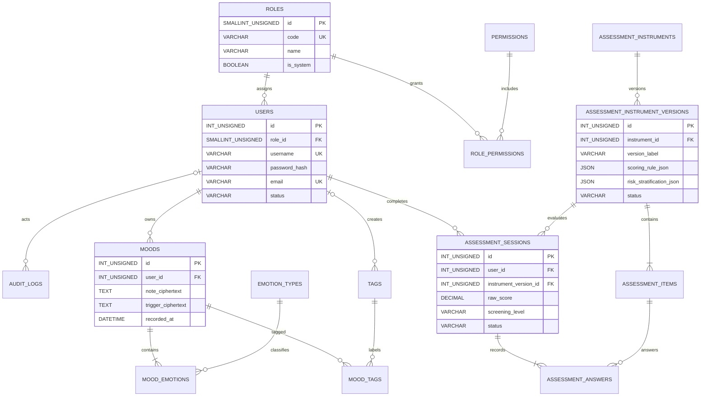

# R0 MySQL 数据库迁移方案

## 文档状态

- 状态：已批准
- 批准日期：2026-07-14
- 日期：2026-07-14
- 适用阶段：R0 代码重构与架构稳定
- 上游设计：[架构 V4 Final](../superpowers/specs/2026-07-14-mood-health-platform-optimization-design.md)
- 架构决策：[ADR-001](../architecture/ADR-001.md)
- 实施计划：[R0 代码重构实施计划](../../tasks/plan.md)

## 1. 结论

R0 使用 MySQL 8.4 LTS、InnoDB、`utf8mb4` 和 `mysql2/promise` 建立全新数据库。旧 SQLite 只保留离线备份，不迁移旧用户、情绪、问卷或其他业务记录；SQL Server 不保留替代路径。

迁移采用按领域切换方式：

```text
备份旧 SQLite
→ 创建全新 MySQL Schema
→ 执行 Migration
→ 执行确定性 Seed
→ Repository 集成测试
→ 单领域切换 MySQL
→ 验证并删除该领域旧分支
→ 进入下一领域
```

迁移期间禁止双写、禁止跨数据库事务、禁止把旧脏数据回填到 MySQL。单个业务请求只允许访问一个已选定的数据源。所有 R0 核心领域切换后，MySQL 成为活动运行时唯一业务数据库。

目标镜像使用官方 MySQL 8.4 LTS 系列；实施时固定补丁版本，初始建议 `mysql:8.4.10`，不得使用会自动跨主版本变化的 `latest`。[MySQL 8.4 官方手册](https://dev.mysql.com/doc/refman/8.4/en/)、[Docker MySQL 官方镜像标签](https://hub.docker.com/_/mysql/tags?name=8.4)

## 2. 范围与非范围

### 2.1 R0 纳入范围

1. Migration 版本表和执行器。
2. 用户、固定角色、权限和角色权限映射。
3. 审计日志。
4. 情绪类型、标签、情绪记录及关联关系。
5. 通用心理测评目录、版本、题目、作答批次和答案。
6. 确定性 Reference、Demo、Test Seed。
7. Repository 集成测试、切换验证和旧数据库运行路径清退。

### 2.2 R0 不纳入范围

- 不迁移任何 SQLite 历史记录。
- 不迁移活动、社区、课程、音乐、放松和成就表；相关模块继续由功能开关关闭。
- 不建设风险个案、分配、干预、转介和结案表；它们在 P0/v1.0 PRD 确认后新增。
- 不建设 AI 分析记录、Prompt、报告或 `input_summary` 表；它们属于 v1.1。
- 不确定具体心理量表，不录入未经确认的评分、风险分层或诊断规则。
- 不引入 ORM、读写分离、数据库集群或分库分表。

## 3. 旧 SQLite 结构处置

旧库元数据只用于识别当前接口依赖，不作为 MySQL Schema 的复制模板。

| 旧表/逻辑 | R0 处置 | MySQL 对应 |
|---|---|---|
| `users` | 重新设计，不导入记录 | `users`、`roles`、`permissions`、`role_permissions` |
| `operation_logs` | 重新设计，不导入记录 | `audit_logs` |
| `moods` | 去除逗号字符串冗余，敏感文本继续加密 | `moods` |
| `emotion_types` | 作为 Reference Seed 重建 | `emotion_types` |
| `tags` | 重建系统标签和用户标签 | `tags` |
| `mood_emotions`、`mood_tags` | 规范化重建 | 同名关联表 |
| `questionnaires`、`questions` | 改为带版本的通用测评目录 | `assessment_instruments`、`assessment_instrument_versions`、`assessment_items` |
| `user_assessments`、`user_answers` | 增加明确作答批次和规则版本关联 | `assessment_sessions`、`assessment_answers` |
| `activities`、`activity_participants` | R0 不迁移 | P1/P2 待定 |
| `posts`、`comments`、点赞表 | R0 不迁移 | P1/P2 待定 |
| 课程、音乐、放松、成就相关动态表 | R0 不迁移 | P1/P2 待定 |
| `advice_history` | 不迁移，避免把旧规则结果误当 AI 记录 | v1.1 重新设计 |
| `incident_fix_list`、`feedback_close_list` | 不迁移；缺少稳定业务实体和 PRD 定义 | P0 PRD 决定是否保留 |

现有 `questionnaireController.ts` 中写死的 SDS/SAS 计分、阈值和“轻度/中度/重度”结论不得复制到 Migration、Seed 或新 Repository。具体量表确认前，MySQL 中不存在面向用户启用的心理量表版本。

## 4. 数据库全局规范

| 项目 | 规范 |
|---|---|
| MySQL | 8.4 LTS，实施时固定补丁镜像 |
| 存储引擎 | InnoDB |
| 字符集 | `utf8mb4` |
| 排序规则 | `utf8mb4_0900_ai_ci` |
| 标识符 | 小写 `snake_case`，表名使用复数 |
| 主键 | `INT UNSIGNED AUTO_INCREMENT`，避免 Node.js `BIGINT` 字符串映射负担 |
| 时间 | `DATETIME(3)`，数据库与应用统一写 UTC，前端转换为 Asia/Shanghai |
| 布尔值 | `TINYINT(1)`，必要时增加 `CHECK` |
| 状态值 | `VARCHAR` + `CHECK`，不使用难以演进的 `ENUM` |
| JSON | 只用于版本化规则配置和结构化答案，不替代正常关系建模 |
| SQL 模式 | 严格模式，拒绝非法日期、截断和无效类型转换 |
| DDL | 只能通过 Migration 修改，禁止 Model 或应用启动时建表 |
| 数据访问 | Repository 唯一访问边界，Service 禁止直接 SQL |
| 时区 | MySQL `default-time-zone=+00:00`，连接配置使用 UTC |

MySQL 8.4 支持执行 `CHECK` 约束，可用于情绪强度、状态等简单不变量；业务含义复杂的心理规则仍由心理评估规则层验证，不能塞进数据库约束。[MySQL 8.4 CHECK 约束](https://dev.mysql.com/doc/refman/8.4/en/create-table-check-constraints.html)

## 5. 目标 ER 关系



图中只展示关键字段；完整字段与约束见数据字典。

## 6. 核心数据字典

### 6.1 `schema_migrations`

| 字段 | 类型 | 约束 | 说明 |
|---|---|---|---|
| `version` | `VARCHAR(32)` | PK | 单调递增版本，如 `0010` |
| `name` | `VARCHAR(128)` | NOT NULL | Migration 名称 |
| `checksum` | `CHAR(64)` | NOT NULL | SQL 文件 SHA-256，防止已执行文件被修改 |
| `execution_ms` | `INT UNSIGNED` | NOT NULL | 执行耗时 |
| `applied_at` | `DATETIME(3)` | NOT NULL | UTC 执行时间 |

### 6.2 `roles`

| 字段 | 类型 | 约束 | 说明 |
|---|---|---|---|
| `id` | `SMALLINT UNSIGNED` | PK, AUTO_INCREMENT | 角色 ID |
| `code` | `VARCHAR(32)` | NOT NULL, UNIQUE | `student`、`counselor`、`super_admin` |
| `name` | `VARCHAR(50)` | NOT NULL | 中文显示名 |
| `description` | `VARCHAR(255)` | NULL | 角色说明 |
| `is_system` | `TINYINT(1)` | NOT NULL, DEFAULT 1 | 内置角色标识 |
| `created_at` | `DATETIME(3)` | NOT NULL | 创建时间 |
| `updated_at` | `DATETIME(3)` | NOT NULL | 更新时间 |

R0 不提供角色增删或动态角色编辑器。三个 `code` 由 Reference Seed 初始化。

### 6.3 `permissions`

| 字段 | 类型 | 约束 | 说明 |
|---|---|---|---|
| `id` | `SMALLINT UNSIGNED` | PK, AUTO_INCREMENT | 权限 ID |
| `code` | `VARCHAR(100)` | NOT NULL, UNIQUE | 稳定权限编码 |
| `name` | `VARCHAR(100)` | NOT NULL | 显示名 |
| `description` | `VARCHAR(255)` | NULL | 权限说明 |
| `created_at` | `DATETIME(3)` | NOT NULL | 创建时间 |

R0 只 Seed 核心权限：个人资料读取、本人情绪 CRUD、测评读取/提交/历史、匿名聚合统计、用户管理、角色分配和审计读取。非核心模块权限在 P1/P2 随模块迁移新增。

### 6.4 `role_permissions`

| 字段 | 类型 | 约束 | 说明 |
|---|---|---|---|
| `role_id` | `SMALLINT UNSIGNED` | PK, FK→`roles.id` | 角色 |
| `permission_id` | `SMALLINT UNSIGNED` | PK, FK→`permissions.id` | 权限 |
| `created_at` | `DATETIME(3)` | NOT NULL | 授权时间 |

外键删除策略均为 `RESTRICT`，防止误删内置角色或仍被引用的权限。

### 6.5 `users`

| 字段 | 类型 | 约束 | 说明 |
|---|---|---|---|
| `id` | `INT UNSIGNED` | PK, AUTO_INCREMENT | 用户 ID |
| `role_id` | `SMALLINT UNSIGNED` | NOT NULL, FK→`roles.id` | 单角色 |
| `username` | `VARCHAR(20)` | NOT NULL, UNIQUE | 与现有 3–20 位校验一致 |
| `password_hash` | `VARCHAR(255)` | NOT NULL | bcrypt 哈希，不保存明文 |
| `email` | `VARCHAR(254)` | NOT NULL, UNIQUE | 邮箱 |
| `nickname` | `VARCHAR(50)` | NULL | 显示昵称 |
| `avatar_url` | `VARCHAR(500)` | NULL | 头像地址 |
| `status` | `VARCHAR(16)` | NOT NULL, DEFAULT `active`, CHECK | `active`、`disabled` |
| `last_login_at` | `DATETIME(3)` | NULL | 最近登录时间 |
| `created_at` | `DATETIME(3)` | NOT NULL | 创建时间 |
| `updated_at` | `DATETIME(3)` | NOT NULL | 更新时间 |

R0 后台优先停用账号，不把旧代码中的跨表硬删除流程原样迁入。物理删除和心理数据保留期限由 P0 PRD 单独确认；测试库清理可物理删除虚构数据。

### 6.6 `audit_logs`

| 字段 | 类型 | 约束 | 说明 |
|---|---|---|---|
| `id` | `INT UNSIGNED` | PK, AUTO_INCREMENT | 日志 ID |
| `actor_user_id` | `INT UNSIGNED` | NULL, FK→`users.id` | 操作者；账号物理删除后置 NULL |
| `actor_role_code` | `VARCHAR(32)` | NOT NULL | 操作时角色快照 |
| `permission_code` | `VARCHAR(100)` | NOT NULL | 校验的权限编码 |
| `action` | `VARCHAR(100)` | NOT NULL | 操作类型 |
| `target_type` | `VARCHAR(50)` | NULL | 目标实体类型 |
| `target_id` | `VARCHAR(64)` | NULL | 目标标识 |
| `result` | `VARCHAR(16)` | NOT NULL, CHECK | `success`、`failed` |
| `summary` | `VARCHAR(1000)` | NULL | 脱敏摘要，不保存心理正文 |
| `ip_address` | `VARCHAR(45)` | NULL | IPv4/IPv6 |
| `request_id` | `VARCHAR(64)` | NULL | 请求追踪 ID |
| `created_at` | `DATETIME(3)` | NOT NULL | 操作时间 |

索引：`(actor_user_id, created_at)`、`(action, created_at)`、`created_at`。

### 6.7 `emotion_types`

| 字段 | 类型 | 约束 | 说明 |
|---|---|---|---|
| `id` | `SMALLINT UNSIGNED` | PK, AUTO_INCREMENT | 情绪类型 ID |
| `code` | `VARCHAR(32)` | NOT NULL, UNIQUE | 稳定代码，不依赖中文名称查询 |
| `name` | `VARCHAR(50)` | NOT NULL | 展示名称 |
| `icon` | `VARCHAR(100)` | NULL | 图标或 emoji |
| `category` | `VARCHAR(32)` | NULL | 展示分类，不作为心理诊断指标 |
| `sort_order` | `SMALLINT UNSIGNED` | NOT NULL, DEFAULT 0 | 排序 |
| `is_active` | `TINYINT(1)` | NOT NULL, DEFAULT 1 | 是否可选 |

### 6.8 `tags`

| 字段 | 类型 | 约束 | 说明 |
|---|---|---|---|
| `id` | `INT UNSIGNED` | PK, AUTO_INCREMENT | 标签 ID |
| `code` | `VARCHAR(64)` | NULL, UNIQUE | 系统标签稳定代码；用户标签为 NULL |
| `owner_user_id` | `INT UNSIGNED` | NULL, FK→`users.id` | NULL 表示系统标签 |
| `name` | `VARCHAR(50)` | NOT NULL | 标签名称 |
| `is_system` | `TINYINT(1)` | NOT NULL, DEFAULT 0 | 系统/用户标签 |
| `created_at` | `DATETIME(3)` | NOT NULL | 创建时间 |

业务规则要求系统标签的 `code` 非 NULL 且 `owner_user_id` 为 NULL；用户标签的 `code` 为 NULL 且 `owner_user_id` 非 NULL。由于 `owner_user_id` 带外键删除动作，不使用涉及该列的跨列 `CHECK`，改由 Repository/Service 验证。索引：`(owner_user_id, name)`、`(is_system, name)`。系统标签通过唯一 `code` 幂等维护，用户标签重复由 `(owner_user_id, name)` 和 Repository 检查共同避免。

### 6.9 `moods`

| 字段 | 类型 | 约束 | 说明 |
|---|---|---|---|
| `id` | `INT UNSIGNED` | PK, AUTO_INCREMENT | 情绪记录 ID |
| `user_id` | `INT UNSIGNED` | NOT NULL, FK→`users.id` | 所属学生 |
| `note_ciphertext` | `TEXT` | NULL | AES-256-GCM 加密后的事件/记录内容 |
| `trigger_ciphertext` | `TEXT` | NULL | 加密后的触发因素 |
| `recorded_at` | `DATETIME(3)` | NOT NULL | 用户记录时间 |
| `created_at` | `DATETIME(3)` | NOT NULL | 创建时间 |
| `updated_at` | `DATETIME(3)` | NOT NULL | 更新时间 |

不保留旧 `mood_type`、`intensity`、逗号 `tags` 三份冗余字段；情绪类型和强度统一由 `mood_emotions` 表承载。索引：`(user_id, recorded_at DESC)`。

### 6.10 `mood_emotions`

| 字段 | 类型 | 约束 | 说明 |
|---|---|---|---|
| `mood_id` | `INT UNSIGNED` | PK, FK→`moods.id` | 情绪记录 |
| `emotion_type_id` | `SMALLINT UNSIGNED` | PK, FK→`emotion_types.id` | 情绪类型 |
| `intensity` | `TINYINT UNSIGNED` | NOT NULL, CHECK 1–10 | 用户主观强度，不是诊断分数 |
| `is_primary` | `TINYINT(1)` | NOT NULL, DEFAULT 0 | 主要情绪标识 |

Service 保证一条记录最多一个主要情绪。删除 `moods` 时级联删除关联；情绪类型被使用时禁止删除，只允许停用。

### 6.11 `mood_tags`

| 字段 | 类型 | 约束 | 说明 |
|---|---|---|---|
| `mood_id` | `INT UNSIGNED` | PK, FK→`moods.id` | 情绪记录 |
| `tag_id` | `INT UNSIGNED` | PK, FK→`tags.id` | 标签 |

两个外键均在父记录删除时级联清理关联行。

### 6.12 `assessment_instruments`

| 字段 | 类型 | 约束 | 说明 |
|---|---|---|---|
| `id` | `INT UNSIGNED` | PK, AUTO_INCREMENT | 量表定义 ID |
| `code` | `VARCHAR(64)` | NOT NULL, UNIQUE | 稳定代码，具体值后续确认 |
| `name` | `VARCHAR(100)` | NOT NULL | 名称 |
| `description` | `TEXT` | NULL | 用途说明 |
| `status` | `VARCHAR(16)` | NOT NULL, DEFAULT `draft`, CHECK | `draft`、`active`、`retired` |
| `created_at` | `DATETIME(3)` | NOT NULL | 创建时间 |
| `updated_at` | `DATETIME(3)` | NOT NULL | 更新时间 |

R0 Reference/Demo Seed 不创建面向用户启用的具体量表。

### 6.13 `assessment_instrument_versions`

| 字段 | 类型 | 约束 | 说明 |
|---|---|---|---|
| `id` | `INT UNSIGNED` | PK, AUTO_INCREMENT | 版本 ID |
| `instrument_id` | `INT UNSIGNED` | NOT NULL, FK→`assessment_instruments.id` | 所属量表 |
| `version_label` | `VARCHAR(32)` | NOT NULL | 版本标识 |
| `language` | `VARCHAR(16)` | NOT NULL, DEFAULT `zh-CN` | 语言版本 |
| `target_population` | `VARCHAR(255)` | NULL | 适用人群 |
| `theoretical_basis` | `TEXT` | NULL | 理论依据说明 |
| `source_citation` | `TEXT` | NULL | 研究、指南或正式来源 |
| `license_note` | `TEXT` | NULL | 使用授权说明 |
| `scoring_rule_json` | `JSON` | NULL | 经确认的计分规则配置 |
| `risk_stratification_json` | `JSON` | NULL | 经确认的风险分层配置 |
| `suggestion_template_json` | `JSON` | NULL | 经审核的建议模板 |
| `status` | `VARCHAR(16)` | NOT NULL, DEFAULT `draft`, CHECK | `draft`、`active`、`retired` |
| `checksum` | `CHAR(64)` | NOT NULL | 版本内容校验值 |
| `published_at` | `DATETIME(3)` | NULL | 启用时间 |
| `created_at` | `DATETIME(3)` | NOT NULL | 创建时间 |

唯一约束：`(instrument_id, version_label, language)`。版本一旦进入 `active` 不允许原地修改；修改必须创建新版本。Service 只允许来源、适用人群、授权和规则完整的版本进入 `active`，数据库不自行解释或创造心理规则。

### 6.14 `assessment_items`

| 字段 | 类型 | 约束 | 说明 |
|---|---|---|---|
| `id` | `INT UNSIGNED` | PK, AUTO_INCREMENT | 题目 ID |
| `instrument_version_id` | `INT UNSIGNED` | NOT NULL, FK | 所属量表版本 |
| `item_code` | `VARCHAR(32)` | NOT NULL | 版本内稳定题号 |
| `prompt` | `TEXT` | NOT NULL | 题目文本 |
| `item_type` | `VARCHAR(32)` | NOT NULL | 单选、量级等 |
| `options_json` | `JSON` | NOT NULL | 选项及原始值，不在 Controller 猜测得分 |
| `is_reverse` | `TINYINT(1)` | NOT NULL, DEFAULT 0 | 是否按已批准规则反向计分 |
| `sort_order` | `SMALLINT UNSIGNED` | NOT NULL | 排序 |

唯一约束：`(instrument_version_id, item_code)` 和 `(instrument_version_id, sort_order)`。

### 6.15 `assessment_sessions`

| 字段 | 类型 | 约束 | 说明 |
|---|---|---|---|
| `id` | `INT UNSIGNED` | PK, AUTO_INCREMENT | 作答批次 ID |
| `user_id` | `INT UNSIGNED` | NOT NULL, FK→`users.id` | 学生 |
| `instrument_version_id` | `INT UNSIGNED` | NOT NULL, FK | 使用的固定版本 |
| `status` | `VARCHAR(16)` | NOT NULL, DEFAULT `draft`, CHECK | `draft`、`submitted` |
| `raw_score` | `DECIMAL(8,2)` | NULL | 规则计算的原始/总分，不代表诊断 |
| `screening_level` | `VARCHAR(32)` | NULL | 量表定义的筛查分层代码 |
| `result_text` | `TEXT` | NULL | 提交时结果快照，必须附非诊断提示 |
| `started_at` | `DATETIME(3)` | NOT NULL | 开始时间 |
| `submitted_at` | `DATETIME(3)` | NULL | 提交时间 |
| `created_at` | `DATETIME(3)` | NOT NULL | 创建时间 |

索引：`(user_id, submitted_at DESC)`、`instrument_version_id`。同一提交事务内保存答案、计算结果并将状态改为 `submitted`。

### 6.16 `assessment_answers`

| 字段 | 类型 | 约束 | 说明 |
|---|---|---|---|
| `id` | `INT UNSIGNED` | PK, AUTO_INCREMENT | 答案 ID |
| `session_id` | `INT UNSIGNED` | NOT NULL, FK→`assessment_sessions.id` | 作答批次 |
| `item_id` | `INT UNSIGNED` | NOT NULL, FK→`assessment_items.id` | 题目 |
| `answer_value` | `JSON` | NOT NULL | 结构化答案原值 |
| `item_score` | `DECIMAL(8,2)` | NULL | 经版本规则计算的题目得分 |
| `created_at` | `DATETIME(3)` | NOT NULL | 创建时间 |

唯一约束：`(session_id, item_id)`。Repository 必须验证题目属于该批次使用的量表版本。

## 7. 外键与删除策略

| 关系 | 删除策略 | 原因 |
|---|---|---|
| `roles` → `users` | RESTRICT | 不允许删除仍被用户使用的内置角色 |
| `users` → `audit_logs` | SET NULL | 保留操作事实与角色快照 |
| `users` → `moods` | CASCADE | 明确物理删除时同步删除个人情绪数据 |
| `users` → `tags` | CASCADE | 删除个人标签 |
| `moods` → 关联表 | CASCADE | 防止孤儿关联 |
| `emotion_types` → `mood_emotions` | RESTRICT | 已使用类型只能停用 |
| 量表 → 版本 → 题目 | RESTRICT | 已用于历史测评的版本不能物理删除 |
| `users` → `assessment_sessions` | CASCADE | 明确物理删除时删除个人测评数据 |
| `assessment_sessions` → `assessment_answers` | CASCADE | 删除批次时删除答案 |

应用默认使用账号停用而不是物理删除。正式的数据删除、保留期限和管理员操作权限必须在 P0 PRD 中明确后再开放。

## 8. 固定角色与核心权限 Seed

### 8.1 角色

| code | 显示名 | R0 数据范围 |
|---|---|---|
| `student` | 学生用户 | 仅本人情绪、本人测评和本人资料 |
| `counselor` | 心理工作人员 | 匿名聚合统计；R0 无个案详情能力 |
| `super_admin` | 超级管理员 | 用户/角色分配、匿名聚合、系统审计；不默认读取心理正文 |

### 8.2 核心权限编码

| 权限编码 | student | counselor | super_admin |
|---|:---:|:---:|:---:|
| `auth.profile.read` | ✓ | ✓ | ✓ |
| `mood.record.create` | ✓ |  |  |
| `mood.record.read_own` | ✓ |  |  |
| `mood.record.update_own` | ✓ |  |  |
| `mood.record.delete_own` | ✓ |  |  |
| `assessment.instrument.read` | ✓ |  |  |
| `assessment.submit` | ✓ |  |  |
| `assessment.history.read_own` | ✓ |  |  |
| `report.aggregate.read` |  | ✓ | ✓ |
| `user.manage` |  |  | ✓ |
| `user.role.assign` |  |  | ✓ |
| `audit.log.read` |  |  | ✓ |

风险个案相关权限在 P0 PRD 确认后通过新 Migration 增加，不提前占位。

## 9. Migration 目录与版本序列

```text
mood_health_server/src/db/
├── bootstrap/
│   └── schema_migrations.sql
├── migrations/
│   ├── 0010_create_roles.up.sql
│   ├── 0010_create_roles.down.sql
│   ├── 0020_create_permissions.up.sql
│   ├── 0020_create_permissions.down.sql
│   ├── 0030_create_role_permissions.up.sql
│   ├── 0030_create_role_permissions.down.sql
│   ├── 0040_create_users.up.sql
│   ├── 0040_create_users.down.sql
│   ├── 0050_create_audit_logs.up.sql
│   ├── 0050_create_audit_logs.down.sql
│   ├── 0060_create_emotion_types.up.sql
│   ├── 0060_create_emotion_types.down.sql
│   ├── 0070_create_tags.up.sql
│   ├── 0070_create_tags.down.sql
│   ├── 0080_create_moods.up.sql
│   ├── 0080_create_moods.down.sql
│   ├── 0090_create_mood_emotions.up.sql
│   ├── 0090_create_mood_emotions.down.sql
│   ├── 0100_create_mood_tags.up.sql
│   ├── 0100_create_mood_tags.down.sql
│   ├── 0110_create_assessment_instruments.up.sql
│   ├── 0110_create_assessment_instruments.down.sql
│   ├── 0120_create_assessment_versions.up.sql
│   ├── 0120_create_assessment_versions.down.sql
│   ├── 0130_create_assessment_items.up.sql
│   ├── 0130_create_assessment_items.down.sql
│   ├── 0140_create_assessment_sessions.up.sql
│   ├── 0140_create_assessment_sessions.down.sql
│   ├── 0150_create_assessment_answers.up.sql
│   └── 0150_create_assessment_answers.down.sql
├── migrate.ts
└── migrationRunner.ts
```

每个版本只创建一张表或一个紧密关联对象，减少多条 DDL 中途失败后的人工恢复范围。索引、外键和本表约束随建表语句创建。

`tasks/plan.md` 中出现的 Migration 文件名是逻辑范围提示；本节的版本号、依赖顺序和 up/down 文件对是实施时的唯一准则。

### 9.1 Runner 规则

1. 迁移前获取 MySQL 命名锁，避免两个进程并发执行。
2. 按文件名前缀排序，验证版本唯一和 up/down 成对。
3. 计算 SQL 文件 SHA-256；已执行版本的 checksum 不同则立即失败。
4. 执行成功后才写入 `schema_migrations`。
5. 失败时停止后续版本，输出版本、语句序号和脱敏错误。
6. 若 DDL 已成功但 `schema_migrations` 记录失败，Runner 检测到未登记对象后停止；人工核对 Schema 与 checksum 后决定清理对象重跑或受控补记，禁止自动跳过。
7. Migration 不使用 `IF NOT EXISTS` 掩盖 Schema 漂移；bootstrap 版本表除外。
8. 已应用 Migration 永不原地修改，变更必须新增版本。

MySQL 8.4 的 atomic DDL 是“单条 DDL 原子”，不是把多条 DDL 组成可整体回滚的事务；DDL 还会隐式结束当前事务。因此不能承诺用普通 `ROLLBACK` 撤销整份多语句 Migration。[MySQL Atomic DDL](https://dev.mysql.com/doc/refman/8.4/en/atomic-ddl.html)、[MySQL 事务控制](https://dev.mysql.com/doc/refman/8.4/en/commit.html)

### 9.2 Down 与生产回退

- 每个 up 文件都有开发/测试用 down 文件，并在空测试库验证 `up → down → up`。
- down 按反向依赖顺序执行，不允许跳过中间版本。
- 生产或演示服务器存在有效数据后，破坏性 down 不作为首选回退；优先回滚应用、前向修复或恢复迁移前备份。
- 删除表、删除列和修改数据类型必须单独版本，执行前确认零代码引用并完成备份。
- 后续字段改名采用 expand → 切换读取 → contract，不原地改名并立即删除旧字段。

## 10. Seed 设计

Seed 与 Migration 分离。Migration 只创建结构，Seed 只创建可重复的 Reference、Demo 或 Test 数据。

### 10.1 Seed Profile

| Profile | 内容 | 使用环境 |
|---|---|---|
| `reference` | 三个角色、核心权限、角色权限、情绪类型、系统标签 | 所有环境 |
| `demo` | 三类演示账号、虚构情绪记录、可展示的趋势数据 | 本地和阿里云演示环境，需显式授权 |
| `test` | 测试账号、边界数据、不可见的技术测试问卷 | 独立测试库 |

### 10.2 规则

1. Reference Seed 通过稳定 `code` 幂等 upsert。
2. Demo 用户使用固定 username 定位；重跑前只清理这些虚构用户的演示记录，不影响其他用户。
3. 演示密码从 `DEMO_PASSWORD` 环境变量读取，禁止写入 Git。
4. `demo` 必须要求 `ALLOW_DEMO_SEED=true`，防止误写普通环境。
5. Test Seed 每次在独立数据库执行，测试结束后销毁数据库。
6. R0 不在 Demo/Reference Seed 中创建具体心理量表。
7. Test Profile 可创建只用于程序验证的 `TECHNICAL_FIXTURE` 问卷，但必须不可见、无心理学名称、无诊断文案，不能用于论文量表结论。
8. 情绪演示记录为虚构内容，日期相对 Seed 执行日生成，覆盖最近 30 天趋势和空数据边界。

## 11. Repository 边界

R0 Repository 至少包含：

```text
repositories/
├── userRepository.ts
├── accessRepository.ts
├── auditRepository.ts
├── moodRepository.ts
├── assessmentRepository.ts
└── managementRepository.ts
```

### 11.1 规则

- Repository 接收领域参数或查询对象，返回领域数据，不返回 `mysql2` 原始 RowDataPacket。
- SQL 参数全部使用占位符，禁止字符串拼接用户输入。
- 事务由 Service 请求并传入同一 connection，Repository 不自行创建嵌套连接。
- Controller、Middleware 和普通 Service 不导入 `mysql2`。
- 不建立通用 BaseRepository；仅抽取连接、事务和错误映射等确定重复逻辑。
- `SELECT *` 不进入新代码，字段列表必须显式。

### 11.2 核心事务

| 业务 | 同一事务内操作 |
|---|---|
| 创建情绪记录 | 插入 `moods`、`mood_emotions`、`mood_tags` |
| 更新情绪记录 | 校验归属、更新主表、替换情绪与标签关联 |
| 提交测评 | 创建/锁定 session、写 answers、计算并写结果、状态变为 submitted |
| 角色分配 | 更新 `users.role_id`、写 `audit_logs` |

## 12. 分领域切换方案

### 12.1 切换原则

临时数据源选择只存在于应用 Composition Root，不允许在 Model/Repository 方法中继续堆叠 `if sqlite / else mysql`。每个领域只能选择一个实现：

```text
Domain Service
      ↓
Repository Interface
      ↓
Legacy SQLite Adapter  或  MySQL Repository
```

领域切换顺序：

1. 用户与认证。
2. RBAC 与审计。
3. 情绪记录。
4. 心理测评存储。
5. 管理匿名聚合。

### 12.2 每个领域的标准步骤

1. 执行所需 Migration 和 Reference/Test Seed。
2. 完成 MySQL Repository 集成测试。
3. 使用虚构账号执行 API 契约和人工回归。
4. 将该领域 Composition Root 切换到 MySQL。
5. 运行静态依赖检查和数据库访问日志，确认请求不再触发 SQLite。
6. 经检查点批准后，独立删除该领域 Legacy Adapter、旧 SQL 和切换开关。
7. 再进入下一个领域。

不按用户百分比灰度，不双写，不同步旧数据。由于项目目标是干净重建和小规模演示，按领域切换比按流量切换更简单、可验证。

## 13. 回退策略

### 13.1 Schema 尚未切换

- Migration 失败立即停止。
- 测试/开发库执行对应 down 或直接销毁 Volume 后重新 migrate。
- 应用仍使用旧领域实现，不受未启用 MySQL 表影响。

### 13.2 领域已切换但旧实现尚未删除

- 只允许在没有真实用户写入的验证窗口回切 Legacy Adapter。
- MySQL 验证数据不反向同步 SQLite；回切后重新使用虚构测试账号。
- 记录失败原因，修复后重新执行该领域完整验收。

### 13.3 旧实现已删除

- 回滚应用提交并恢复迁移前 MySQL 备份，或创建前向修复 Migration。
- SQLite 备份仅用于历史留存与紧急演示对照，不作为长期生产回退数据库。
- 任何破坏性 Schema 变更前执行 `mysqldump --single-transaction` 并验证可恢复。

## 14. 测试策略

### 14.1 Migration 测试

- 空库完整 migrate。
- 重复 migrate 无重复执行。
- 修改已应用文件后 checksum 校验失败。
- 中间版本故意失败后停止后续版本。
- 每个版本执行 `up → down → up`。
- 从任意已支持版本升级到最新版本。

### 14.2 Repository 集成测试

- 使用独立 MySQL 测试库，不 Mock MySQL。
- 每个测试创建自己的用户和业务数据，不使用固定 `999999`。
- 覆盖唯一约束、外键、事务回滚、分页、排序和数据范围。
- 敏感字段在数据库中不能出现可读明文。

### 14.3 切换与清退测试

- 启动后仓库目录不生成或修改 `.db`、`.db-wal`、`.db-shm`。
- 活动核心请求只出现在 MySQL 查询日志/应用 Repository 日志中。
- 被关闭模块返回统一不可用响应且不导入 SQLite 初始化链路。
- 全仓 `mssql` 运行引用最终为零。
- R0/v1.0 活动运行路径 SQLite 引用为零；遗留引用只能位于停用模块并有 P1/P2 清退任务。

### 14.4 性能基线

执行已批准的 `Task PERF`：在相同 2 核 2G 资源限制、Seed 规模、预热、请求量和并发度下，对比首页、登录、代表性数据库查询、CPU 和内存。结果无改善时如实记录，不因论文叙述修改数据。

## 15. 数据安全与最小权限

### 15.1 数据库账号

| 账号 | 权限 | 使用场景 |
|---|---|---|
| `root` | 容器初始化和紧急运维 | 不提供给应用 |
| `mood_migrator` | Schema 变更与 Migration | 仅迁移命令使用 |
| `mood_app` | 业务表 SELECT/INSERT/UPDATE/DELETE | Node.js API 运行时 |
| `mood_test` | 独立测试库权限 | 自动化测试 |

生产 Compose 不将 MySQL 端口暴露到公网。应用账号不得拥有 `DROP`、`ALTER`、`CREATE USER` 或全局权限。

### 15.2 敏感数据

- 密码只保存 bcrypt hash。
- 情绪事件和触发因素使用现有 AES-256-GCM 机制加密后入库，密钥只来自环境变量。
- 测评答案属于心理敏感数据，只允许学生本人和后续被合法分配的风险个案流程访问。
- counselor 的 R0 查询只返回匿名聚合数据。
- 审计 `summary` 只保存脱敏摘要，不保存情绪正文、测评答案或密码/JWT。
- 数据库备份、演示数据和测试日志不得包含真实学生信息。

## 16. 2 核 2G 配置约束

| 配置 | 初始值 |
|---|---:|
| MySQL `max_connections` | 30 |
| Node.js MySQL Pool `connectionLimit` | 10 |
| MySQL `innodb_buffer_pool_size` | 256M |
| Redis `maxmemory` | 128MB |
| Node.js API | 单进程，容器 512MB，V8 old space 384MB |

连接池必须设置连接、获取和查询超时。不得通过增加连接数解决慢查询；先检查索引、N+1 查询和不必要字段读取。

## 17. 清退门槛

### 17.1 SQL Server 最终删除

- [ ] 所有核心和停用模块均无 `mssql` 导入。
- [ ] `mssql` 与 `@types/mssql` 已从 package/lockfile 删除。
- [ ] SQL Server 环境变量、初始化脚本、测试和文档已删除或归档。
- [ ] 全仓静态搜索只允许历史决策文档出现“SQL Server”。
- [ ] MySQL 环境前后端构建、测试和启动全部通过。

### 17.2 SQLite 的 R0/v1.0 退出门槛

- [ ] 用户、RBAC、审计、情绪、测评和管理聚合全部使用 MySQL Repository。
- [ ] 应用默认启动不打开或创建 SQLite 文件。
- [ ] 核心路由导入图不可到达 SQLite 配置。
- [ ] 社区、活动、课程、音乐、放松和成就入口前后端均关闭。
- [ ] SQLite 主库已有离线备份和 SHA-256 清单。
- [ ] 保留的 SQLite 源码只属于停用模块，并已列入 P1/P2 迁移清单。

全仓 SQLite 遗留实现的物理删除在 P1/P2 非核心模块逐个迁移后完成；这不构成长期双数据库运行兼容，因为 v1.0 活动运行路径只使用 MySQL。

## 18. R0 数据库迁移完成标准

1. `docker compose up -d mysql redis` 后健康检查通过。
2. 空库可以执行 Migration、Reference Seed、Demo/Test Seed 和重复验证。
3. 用户、认证、RBAC、审计、情绪、测评、管理聚合 Repository 测试通过。
4. 核心 API 契约、权限隔离和人工闭环通过。
5. MySQL 是活动运行时唯一业务事实来源，Redis 故障不导致数据丢失。
6. SQL Server 依赖清退完成；SQLite 活动运行路径为零。
7. 旧 SQLite 备份仍可验证，但不参与启动、测试或演示数据初始化。
8. Migration、Seed、数据字典、Repository 和实际 Schema 一致。
9. Task PERF 完成重构后复测并保留原始结果。
10. 用户批准 R0 架构稳定验收后，才进入 P0/v1.0 PRD。

## 19. 审核后下一步

本方案批准后，不再继续扩展数据库架构。实施顺序为：

1. 执行 Task 1，记录重构前工程基线。
2. 执行 Task PERF 的重构前性能采样。
3. 执行 Task 2，完成 SQLite 备份和仓库运行产物治理。
4. 按 `tasks/plan.md` 的检查点逐个实施，每个检查点由用户确认后继续。

未经用户批准，不执行 Migration、不清理旧依赖、不删除数据库文件。
