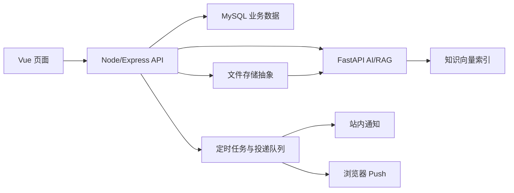

# 心晴管理后台与真实能力整改设计方案

> 日期：2026-08-13  
> 状态：待用户审核，审核通过前不进入业务代码实施  
> 范围：管理后台、知识资料、风险个案、音乐管理、个人中心、通知与周报、AI 心理助手、俄罗斯方块、情绪洞察与分析、AI 响应性能

## 1. 目标与原则

本轮不做“按钮能点但没有后端”的展示型功能，而是把页面、API、数据库、后台任务、文件存储和失败反馈串成可验证的完整闭环。每项功能必须同时满足：页面可操作、接口真实存在、数据可持久化、刷新或重新登录后仍保留、异常时明确报错、自动化测试能够覆盖关键路径。

产品边界继续定位为校园心理健康辅助平台，不替代医生诊断、心理治疗或紧急救援。高风险信号用于提醒有权限的管理员或老师及时人工判断，不直接给学生下诊断结论。

## 2. 当前代码核对结论

| 问题 | 当前真实情况 | 结论 |
|---|---|---|
| 后台切页闪屏 | 子路由使用 `mode="out-in"` 的整页过渡，旧页先离场，新异步页面后进入 | 会出现空白帧和“跳一下” |
| 知识资料报资源不存在 | 学生端资料是前端静态数组；系统没有完整的资料列表、详情、上传、存储、解析 API | 不是简单改 URL，需补齐资源域 |
| 帖子审核 | 路由和侧栏同时存在“帖子审核”“树洞审核” | 与实际业务重复，应移除帖子审核入口 |
| 风险个案 | 当前仅支持人工创建、分配、干预、转介和结案 | 缺少三类自动信号、证据链和去重机制 |
| 音乐管理 | 后端只有查询和更新，前端没有新增入口 | 必须新增创建接口及表单 |
| 我的页面 | 用户名只读、头像是静态占位，收藏计数未接持久化 | 需要资料修改与上传闭环 |
| 设置与通知 | 开关只写入 `localStorage`，没有服务端偏好、定时任务和投递记录 | 当前不是真实提醒/推送 |
| AI 助手 | 会话历史是遮罩层，介绍区和对话区布局不符合要求；调用为一次性等待结果 | 需重排三栏并优化首响应体验 |
| 俄罗斯方块 | 触屏按钮主要在 `touchstart` 时移动一次；持续按压没有稳定的自动重复 | 需统一输入控制器 |
| 情绪洞察/分析 | 页面请求真实接口，但演示账号没有足够记录；现有分析种子只覆盖 `demo_student` 约 30 天 | 需给指定账号生成一年真实明细，再由现有算法分析 |

## 3. 可选实施路线

### 方案 A：按真实业务纵切，分批打通（推荐）

先修复导航和错误契约，再建立资料、风险信号、通知三套基础能力，最后调整界面和补演示数据。每一批都包含数据库、API、前端和 Playwright 验收，完成后即可独立使用。优点是风险可控、定位问题清楚、不会长期留下半成品；缺点是需要按阶段推进。

### 方案 B：先改全部页面外观，再补后端

短期截图变化快，但知识上传、通知、周报、音乐新增仍可能只是空壳，容易再次出现“点得开但不能用”。不采用。

### 方案 C：一次性重写整个后台

可以统一结构，但改动面过大，会同时影响权限、现有接口和已完成模块，回归成本高。当前项目不适合大爆炸式重写，不采用。

最终选择方案 A，并坚持“小改动、小提交、每批可回滚”。

## 4. 总体架构与数据流

前端继续只访问 Node/Express，Node 负责认证、权限、业务规则、数据库和文件元数据；只有 AI 检索与生成请求由 Node 内部转发到 FastAPI。知识资料显示、下载与 RAG 检索共享同一份资料元数据，避免“页面有资料、AI 查不到”或“AI 有资料、页面不存在”。

## 5. 详细功能设计

### 5.1 管理后台无闪屏切换

- 保留后台左侧导航和顶部容器，不在子页面切换时销毁整个框架。
- 移除整页 `out-in` 空窗动画；切换时旧内容立即替换，首屏异步加载使用内容区骨架屏，不出现白屏。
- 登录后空闲预加载常用后台页面代码块，降低第一次点击等待。
- 列表页按需缓存筛选条件和滚动位置；涉及敏感详情或必须刷新的页面不盲目缓存数据。
- 点击当前菜单不重复导航；接口慢时显示局部加载态，菜单本身始终可操作。

验收：连续切换至少 20 次无整屏白闪、无布局横跳、无重复请求风暴；浏览器控制台无路由异常。

### 5.2 知识资料库与“内置资料”文件夹

新增资料域：`knowledge_folders`、`knowledge_resources`、`knowledge_resource_versions`、`knowledge_ingestion_jobs`、`knowledge_favorites`。每条资料记录来源、许可方式、原始链接、文件哈希、版本、上传人、可见范围、解析状态和索引状态。

前端默认展示不可删除的“内置资料”文件夹；老师可新建自有文件夹并上传 PDF、DOCX、TXT、MD。上传经历“校验 → 存储 → 文本解析 → 安全过滤 → 分块 → 向量索引”，状态明确显示为处理中、可用或失败，失败可重试。单文件初始限制 20 MB，文件名、MIME 和实际文件头同时校验，禁止脚本和可执行文件。

接口至少包含：文件夹列表、资料分页列表、资料详情/预览/下载、上传、修改元数据、删除自有资料、重试索引、收藏。内置资料只能由具备系统资料管理权限的管理员更新；普通老师不能覆盖内置版本。

资料版权策略：只把允许再分发的正文或文件真正内置；对仅适合链接引用的资料，保存中文摘要、来源、更新时间和官方链接，不抓取整站内容。首批建议：

- [WHO《Doing What Matters in Times of Stress》](https://www.who.int/publications/b/53604)：页面明确标示 CC BY-NC-SA 3.0 IGO，可在署名、非商业、相同方式共享条件下内置合规版本；需同时遵守 [WHO 版权与许可说明](https://www.who.int/about/policies/publishing/copyright)。
- [NIMH Mental Health Information](https://www.nimh.nih.gov/health/topics)、[Caring for Your Mental Health](https://www.nimh.nih.gov/health/topics/caring-for-your-mental-health) 和 [Anxiety Disorders](https://www.nimh.nih.gov/health/topics/anxiety-disorders)：按 [NIMH 网站政策](https://www.nimh.nih.gov/site-info/policies) 处理文字、公有领域标识、图片限制和来源署名。
- [CDC Managing Stress](https://www.cdc.gov/mental-health/living-with/index.html) 与 [CDC Stacks: Coping with Stress](https://stacks.cdc.gov/view/cdc/100876)：以官方页面/公开文件的许可标识为准，不复制受限图片。
- [国家卫健委 12356 心理援助热线政策](https://www.nhc.gov.cn/yzygj/c100068/202412/49a1a65386cd4be582d4702fd0926ee8.shtml)、[教育部《高等学校学生心理健康教育指导纲要》](https://www.moe.gov.cn/srcsite/A12/moe_1407/s3020/201807/t20180713_342992.html)、[教育部《普通高等学校健康教育指导纲要》](https://www.moe.gov.cn/srcsite/A17/moe_943/moe_946/201707/t20170710_308998.html)：内置标题、摘要和官方链接；是否镜像全文逐条核对版权声明。
- [UNICEF Helping Adolescents Thrive](https://www.unicef.org/adolescentmentalhealthhub/documents/helping-adolescents-thrive-facilitator-guide) 与 [MMAPP Toolkit](https://data.unicef.org/resources/mmapp/)：按页面标示许可决定内置文件或仅做官方链接条目。

首批不追求“数量看起来多”，而追求来源可靠、许可清楚、可追溯。后续可按睡眠、焦虑、压力、情绪调节、人际关系、危机求助、运动放松、校园适应建立子文件夹，并记录季度复核日期。

### 5.3 移除帖子审核

- 从管理员侧栏、路由、权限菜单、面包屑和统计文案中移除“帖子审核”。
- 保留“树洞审核”及树洞业务所需的帖子/评论底层数据，不误删公开社区或树洞模型。
- 原“待审核帖子”统计统一改为“待审核树洞内容”，统计接口与页面口径一致。

### 5.4 风险个案与三类“或”规则

页面统一命名为“风险个案”，修复列表到详情的稳定路由。新增 `risk_signals` 保存信号类型、学生、严重度、触发时间、证据引用、检测版本和处理状态；`case_risk_signals` 关联一个个案可包含多个信号。

规则冻结如下，满足任意一条即可创建或更新风险个案：

1. `mood_low_7d`：连续 7 个自然日，每天的“今日状态分”聚合值均小于 5；缺失日期不能视为低分，也不能凑够 7 条代替 7 天。
2. `treehole_high_risk`：树洞正文或评论的持久化审核结果为高风险。
3. `ai_high_risk`：AI 心理助手已持久化消息的安全判定为高风险。

现有 1–10 字段实际表达“情绪强度”，不能拿来判断心情好坏。因此新增独立 `wellbeing_score`（今日状态分 1–10），记录页明确展示从“很低落”到“状态很好”。实施时对新记录使用该字段；不反推、不伪造旧记录的状态分。

信号检测在对应记录事务提交后异步触发，并有每日兜底扫描。相同学生、相同信号类型和相同触发窗口只生成一条信号；已有未结个案时追加证据并提升风险等级，不重复创建大量个案。后台详情显示“为什么触发、哪条记录触发、何时触发、谁处理过”，敏感原文仅向有权限人员展示并写审计日志。

### 5.5 音乐管理新增

新增“添加音乐”按钮和抽屉表单，后端增加 `POST /api/music`、仓储创建方法、输入校验、权限与审计日志。必填项为标题、作者/来源、分类和可播放音频；支持合规外链，也支持上传音频与封面。保存前可试听，保存后列表立即出现；失效链接要显示失败，不能假装添加成功。同步保留编辑、启停和必要的删除/归档能力。

### 5.6 我的页面：用户名、头像与真实功能

- 新增个人资料编辑：用户名唯一性实时校验，成功后更新当前登录态；头像支持 JPG/PNG/WebP，校验文件头、大小和尺寸，服务端生成安全文件名与缩略图。
- 后端增加个人资料读取/修改和头像上传接口，复用现有 `avatar_url`，所有修改写审计记录。
- 收藏资料数量从 `knowledge_favorites` 实时统计；收藏放松工具等功能若没有真实数据表则本轮补齐，不能固定显示 0。
- “我的记录、收藏、设置、退出登录、注销账号”等入口逐个做路由/API/刷新后持久化验收；没有产品定义的装饰入口直接移除。

### 5.7 设置、提醒、通知与周报

新增服务端偏好和投递模型：`user_notification_preferences`、`notifications`、`push_subscriptions`、`weekly_reports`、`notification_deliveries`。设置保存必须进入数据库，换浏览器或重新登录仍生效。

- 记录提醒：后台定时任务根据用户时区和提醒时间创建站内通知；页面打开时弹出可操作提醒。
- 浏览器推送：用户明确授权后注册 Service Worker 和 Push Subscription；应用关闭时由后端投递。浏览器拒绝权限时明确提示“仅站内提醒”，不能显示“推送已开启”。
- 周报：每周从该用户真实情绪明细计算统计、趋势、波动和记录完整度，生成后保存快照并发送站内通知；如调用 AI 生成文字解读，输入必须来自这份统计，AI 失败时保留可解释的统计报告，不捏造结论。
- 每次投递记录 `pending/sent/failed/read` 和失败原因，管理员可排查，用户可查看通知中心并标记已读。

浏览器/操作系统权限无法被网页强制开启，这是平台限制；本方案通过“请求授权 + 站内兜底 + 失败可见”保证功能真实，而不是伪造成功提示。

### 5.8 AI 心理助手布局与速度

桌面端改为三栏：左侧固定历史会话，中间为对话区，右侧为服务介绍、服务特色和紧急联系。输入框属于中间对话面板并固定在该面板底部，消息区独立滚动，不漂浮到整个浏览器窗口外。平板端右栏折叠为信息抽屉，移动端历史和信息分别从两侧抽屉打开，输入框避让安全区和软键盘。

速度优化先测量 Node、FastAPI、检索、联网搜索、模型首字和总耗时，再处理瓶颈：

- 前端发送后 100 ms 内出现用户消息和“正在回复”；支持取消与失败重试。
- Node 到 FastAPI 改为可观察的流式响应，优先尽快展示首段文字，而非等待整段生成完再出现。
- 高风险请求先走安全判断；普通陪伴对话不强制进行无关联网搜索；需要知识回答时才检索，只有明确允许且本地资料不足时才联网。
- 会话列表刷新改为非阻塞，避免每次回答完成后拖慢主对话；重复查询使用有时效和来源版本约束的缓存。
- 不用虚假兜底答案掩盖上游超时。超时、检索失败、模型失败分别显示明确错误并记录请求 ID。

验收目标：本地链路首个界面反馈不超过 100 ms；真实模型首段响应在正常网络下 p95 不高于 3 秒，普通回答完成 p95 不高于 15 秒。第三方模型不可用时按真实失败验收，不把健康检查或 HTTP 200 当作回答成功。

### 5.9 俄罗斯方块手感

统一键盘和触屏为一个确定性输入控制器。左右按住后先等待 DAS（建议 150 ms），再按 ARR（建议 45 ms）连续移动；松开、移出按钮或页面失焦立即停止。下键为持续软降，空格/专用按钮为硬降，旋转仍是一按一次。触屏使用 Pointer Events 覆盖鼠标、触摸和手写笔，并处理 `pointercancel`，防止按钮卡住。边界和方块碰撞仍由同一移动函数判断。

### 5.10 一年演示数据与真实分析

目标账号按用户口述固定为 `demo_support_admin`。实施第一步先幂等检查账号；不存在则通过正式演示账号种子创建并绑定正确角色，存在则复用，绝不错误写到 `demo_student`。

新增确定性、可重复运行的一年数据种子：覆盖最近 365 个自然日，按每天 1–2 条写入 `moods`、`mood_emotions`、标签关系及独立 `wellbeing_score`。数据包含周末、考试季、假期、睡眠、运动、人际和学习压力等可解释变化，保留少量合理缺失，且至少构造一段满足连续 7 日低于 5 的真实明细用于验证风险个案。所有演示记录标记种子批次，重复运行只更新该批次，不叠加垃圾数据。

种子只生成原始明细，不直接写“分析结论”。完成后由现有情绪洞察聚合接口读取这些行生成月度/年度趋势，再由正式分析接口基于聚合结果生成并持久化分析。验收时随机抽取图表点，与 SQL 聚合结果逐项核对，证明图表和文字都来自这批数据。

## 6. 分阶段实施顺序

| 阶段 | 内容 | 阶段完成标准 |
|---|---|---|
| P0 | 后台无闪切换、移除帖子审核、知识/个案异常路由修复、AI 性能埋点 | 关键页面均能进入，错误有真实原因，建立性能基线 |
| P1 | 知识资料数据库/API/存储/索引、内置资料目录、老师上传 | 上传到检索引用全链路可用 |
| P2 | 风险信号引擎、三类 OR 规则、证据链、去重 | 三种单独条件都能触发，重复事件不重复建案 |
| P3 | 个人资料、头像、收藏、音乐新增 | 修改/新增后刷新和重登仍存在 |
| P4 | 服务端设置、站内提醒、浏览器 Push、真实周报 | 到点实际弹出/推送，报告可追溯到原始数据 |
| P5 | AI 三栏布局、流式首响应、俄罗斯方块持续按压 | 桌面/移动交互和性能目标通过 |
| P6 | `demo_support_admin` 一年种子、真实洞察与分析 | SQL、API、图表、分析四方一致 |
| P7 | 全量回归、安全/隐私/许可检查、毕业设计证据整理 | 单测、集成、Playwright、构建和运行证据齐全 |

## 7. 测试与验收矩阵

每一阶段都先写失败测试，再实现，再执行相关回归。最终至少包含：

- 单元测试：风险三条件、连续自然日、缺失日中断、去重、周报聚合、DAS/ARR、文件校验、资料许可字段。
- API 集成测试：资料 CRUD/上传/索引状态、音乐创建、资料修改、通知偏好、个案证据、权限拒绝、错误码一致性。
- 数据库验证：迁移 up/down、唯一索引、外键、重复种子、365 天覆盖、周报与 SQL 聚合一致。
- Playwright：后台连续切页无空白帧；内置资料展开/预览；老师上传后可检索；三类信号分别创建个案；音乐添加后可试听；头像与用户名重登保留；提醒真实出现；AI 三栏和输入框可用；俄罗斯方块长按连续移动。
- 运行证据：浏览器页面、Network 请求、Node/FastAPI 日志、数据库结果和失败场景同时保留。构建通过、健康检查或单个 HTTP 200 不能单独作为完成证明。

## 8. 安全、隐私与可回滚要求

- 高风险消息、树洞内容、情绪备注按最小权限展示，查询和处理写审计日志；日志不记录完整敏感原文。
- 上传文件防路径穿越、伪造 MIME、超大文件和恶意内容；下载使用授权检查和安全响应头。
- 通知内容默认不在锁屏展示敏感详情，只提示“你有一条新的关怀提醒”。
- 资料每条保留来源、许可和复核日期；发现许可变化可下架正文但保留元数据与引用关系。
- 所有数据库变更使用独立迁移；每个小功能独立提交，不混入当前工作区已有的未提交改动，可逐批回滚。

## 9. 本次审核结论

建议按方案 A 和 P0→P7 顺序执行。审核通过后，下一步再生成精确到文件、接口、迁移、测试和提交粒度的实施计划；在此之前不修改业务代码。默认接受以下产品口径：页面名称统一为“风险个案”；三条规则为严格 OR；连续低分按新增的独立“今日状态分”判断；演示账号为 `demo_support_admin`；浏览器拒绝推送权限时使用真实站内提醒兜底并明确展示状态。
