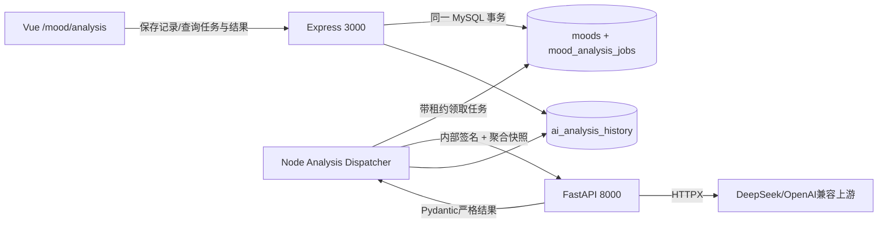

# 基于当前代码的 ABCD 全量优化执行计划

> **For agentic workers:** REQUIRED SUB-SKILL: Use `superpowers:executing-plans` to implement this plan task-by-task. 每次只领取一个任务，先测试后实现，按任务卡单独提交。

> 项目物理目录：`D:\桌面\ccooddee`
> 代码基线：`master` 当前工作区（2026-07-18 只读核验时工作区干净）
> 用途：交给较低等级模型逐个任务执行；不是现状验收报告，也不继承旧计划的“已完成”结论。
> 计划状态：代码校准版 V2（已确认 FastAPI + 自动情绪分析方案 C）。任何任务只有满足本文件的验收标准并保留新鲜证据后，才能标为完成。

## 1. 最重要的执行原则

### 1.1 事实优先级

本计划只按以下顺序判断事实：

1. 当前分支中真实存在、能够被入口引用和运行的代码；
2. 在当前工作区新鲜执行的构建、测试、数据库迁移、接口请求和浏览器证据；
3. 用户在当前任务中的明确决定；
4. 官方框架文档；
5. 仓库内旧 `.md`、旧测试报告、旧验收表和旧截图仅可作为搜索线索，**不得直接作为需求、通过证据或完成证明**。

如果旧文档与代码冲突，低等级模型不得“挑一个看起来顺眼的版本”，而要记录冲突、以当前代码复现结果为准；涉及产品范围、量表授权、AI 服务架构等会改变方向的冲突，必须停手交还用户决定。

### 1.2 四条线独立验收

| 优化线 | 独立目标 | 不能被什么替代 |
| --- | --- | --- |
| A 功能可靠性 | 用户操作真的完成、数据真的保存、服务真的可用、失败说真话 | 构建通过不能代表流程可用 |
| B 页面与交互质量 | 页面清楚、舒适、易操作、及时反馈、可恢复、移动端可用 | A 通过不能代表页面好用 |
| C AI 回复质量 | 安全、理解上下文、有用、可解释、不伪装降级 | 接口返回 200 不能代表回复合格 |
| D 产品整体感 | 首次使用到持续使用形成自然旅程，模块互相承接 | 单页美化不能代表产品完整 |

任务状态只能使用：`未开始 / 进行中 / 通过 / 失败 / 部分通过 / 未验证 / 阻塞`。A、B、C、D 必须分别统计，禁止用“项目已优化”一次性覆盖四条线。

## 2. 当前代码事实快照

以下结论来自 2026-07-18 对当前代码和新鲜命令的核验，不来自旧报告。

### 2.1 真实技术边界

- 前端：Vue 3.5、Vue Router 4.6、Pinia 2.3、Vite 5.2、TypeScript 5.2、Element Plus 2.13，开发端口 3001。
- Node 后端：Express 5.2、TypeScript 5.9、MySQL2、Ioredis、Jest，端口 3000。
- 数据层：`docker-compose.yml` 声明 MySQL 8.4.10 与 Redis 7；当前迁移目录中有 31 个 `*.up.sql`。
- 浏览器自动化：根项目已安装 Playwright，并已声明 `npm run test:e2e`。
- AI：当前可执行代码是 Node 后端中的 `mood_health_server/src/utils/ai/aiClient.ts` 直接调用 DeepSeek/OpenAI 兼容接口。
- Python/FastAPI：仓库中没有任何 `.py` 文件，也没有 `mood_health_server/main.py`；`requirements.txt`、8000 端口代理及 Python 启动说明属于悬空配置，不能声称 FastAPI 服务已经存在。
- 情绪分析：Node 已有 `GET /api/moods/analysis`、`GET /api/moods/insight` 两套统计逻辑，前端只有 `/mood/insight` 页面；当前 `/api/ai/insight` 让前端回传统计再由 Node 直连模型，不能作为目标架构。

### 2.2 新鲜基线结果

| 命令/检查 | 当前结果 | 计划含义 |
| --- | --- | --- |
| `npm run typecheck:all` | 失败；前端 API 测试类型错误，且后端没有 `typecheck` 脚本 | 先恢复静态检查入口 |
| `npm run test:all` | 失败；前端 6 项失败，命令短路，未继续后端 | 不能把单一聚合命令当全量证据 |
| `npm --prefix mood_health_server run build` | 失败；控制器、Redis 封装、告警服务、AI 调用等多处 TS 错误 | P0 必须先修编译链 |
| `npm --prefix mood_health_server run test:stable` | 33 套通过、10 套失败；151 项通过、16 项失败 | 测试与实现均需逐项判断，不能全归因于旧测试 |
| `npm run doctor` | 失败；缺少 `start-project.ps1`，3001/3000 未运行 | 启动合同不真实 |
| `git status --short` | 空 | 本计划生成前没有业务代码改动 |

### 2.3 已定位的关键代码冲突

- `src/views/guide/GuidePage.vue` 使用不存在的 `/mood/analysis`、`/auth/login`；目标是实现真实 `/mood/analysis`，并将登录链接修正为 `/login`，旧 `/mood/insight` 最终重定向到新页面。
- `src/App.vue` 的退出登录只清前端状态，不调用后端 `/api/auth/logout`，HttpOnly Cookie 可能仍有效。
- `src/stores/relaxStore.ts` 使用硬编码 `current-user-id`，保存失败后生成本地记录，容易给用户“保存成功”的错觉。
- `src/components/relax/BreathingGuide.vue` 随机生成专注度、平均心率，属于不可接受的假健康数据。
- `src/api/activityApi.ts`、`src/api/admin.ts` 等处在全局请求封装已解包后再次读取 `.data`，存在跨模块接口形状漂移。
- `src/config/featureFlags.ts` 无视环境变量并始终开启非核心模块；后端也没有真实关闭列表。
- `mood_health_server/src/db/seeds/profileSeed.ts` 会种入活动状态的技术测试量表及评分规则；未取得来源、授权和业务批准前不得面向用户。
- `mood_health_server/src/utils/ai/moodAnalysisService.ts` 解析失败后返回固定分析但没有可靠地告诉前端这是降级内容。
- `mood_health_server/src/utils/ai/contentAuditService.ts` 在 AI 审核解析失败时可能按安全处理；社区心理安全链路不应静默放行。
- `src/views/counseling/Counseling.vue` 的会话仅在内存中，和 `/ai-history` 之间没有自然的持久化承接。
- 引导页、首页、导航和页脚对功能状态、产品名称、年份的表达不一致；首页仍把部分已暴露模块写成“待开发”。
- 多处可点击 `div`、自制弹窗、`outline: none` 缺少键盘语义、焦点管理和可恢复反馈。

## 3. 已批准的目标架构：FastAPI + 自动情绪分析

用户已明确选择独立 FastAPI AI 服务，并选择方案 C：每次情绪记录后自动创建可追踪、可恢复、有历史版本的情绪分析任务。当前没有 Python 源码不是放弃 FastAPI 的理由，而是本计划必须补齐的真实缺口。



### 3.1 固定职责边界

- Vue 只访问 Node，禁止浏览器直连 FastAPI，也禁止把客户端计算的统计回传给 AI 当作可信输入。
- Node 负责 Cookie 身份、MySQL、用户所有权、数据聚合、隐私授权、任务和历史；FastAPI 不连接 MySQL、不接收真实用户 ID、Cookie 或 Token。
- Node 在保存情绪记录的同一事务中创建 7 天 pending 任务，保存接口不等待 AI。独立 dispatcher 负责租约、幂等、重试和重启恢复。
- FastAPI 是无状态分析引擎：校验内部签名和输入，调用模型，严格验证结构化输出；不保存日记或业务结果。
- 迁移期间 Node 直连仅可服务尚未迁移的咨询/树洞等旧消费者。情绪分析切换后不得回退 Node 直连；全部消费者迁移并回归后删除旧主链。

### 3.2 已批准的产品与隐私决定

- 正式页面为 `/mood/analysis`；旧 `/mood/insight` 使用 Vue Router redirect 保留兼容。
- 周期固定为 `7d/1m/3m/6m/1y`，对应 7 天、1 个月、3 个月、6 个月、1 年；前后端不得再各用一套 `day/week/month/year` 或 `week/month/quarter`。
- 每次记录后自动生成/合并 7 天分析；其他周期首次查看或数据版本过期时生成，相同数据版本直接复用。
- 默认只向 FastAPI/模型发送结构化聚合数据。日记正文只有用户在本次记录中主动勾选时才能发送，不能成为账号默认。
- 0 条记录不调用模型；1 条记录只能称为“单次记录回顾”；样本不足不得写趋势或确定原因。
- 不输出模型编造的 `mood_score`、固定 `confidence`、临床风险分、诊断或未经批准的量表结论。

### 3.3 Python 固定基线

- 本机当前 Python 为 3.11.9，目标运行基线使用 Python 3.11。
- 固定依赖：`fastapi[standard]==0.139.2`、`pydantic==2.13.4`、`pydantic-settings==2.14.2`、`httpx==0.28.1`、`uvicorn==0.51.0`。
- 测试/质量依赖：`pytest==9.1.1`、`pytest-asyncio==1.4.0`、`respx==0.23.1`、`ruff==0.15.22`、`mypy==2.3.0`。
- 新服务目录固定为 `mood_health_ai_service/`，使用 `pyproject.toml` 和锁文件。旧 `mood_health_server/requirements.txt` 在新服务可安装后删除或迁移，禁止继续保留 Torch/Transformers 等无人调用依赖来伪装本地模型。

## 4. 给低等级模型的固定执行协议

每次只领取一个任务 ID，并严格执行：

1. 确认当前物理目录是 `D:\桌面\ccooddee`，执行 `git status --short`；若有不属于当前任务的改动，停止并报告。
2. 只读任务卡列出的生产文件、相邻测试和真实调用入口；不要先读旧验收报告来猜答案。
3. 先运行任务卡的“修复前验证”，记录失败现象；敏感信息只记状态码、requestId、耗时，不记 Cookie、Token、API Key、完整心理文本。
4. 只修改任务卡范围；预估超过 5 个生产文件，或需要改数据库结构却任务卡未授权时，停止并拆分。
5. 新增或更新自动化测试，再运行“最小验证”；不得通过删测试、跳过测试、放宽断言来制造绿色。
6. 运行 `git diff --check`，逐文件检查 diff；只暂存本任务的明确文件，禁止 `git add -A`。
7. 一个小改动一个提交，提交格式使用 `fix(A2-03): ...`、`feat(B-06): ...`、`test(A1-02): ...`。提交后再次确认工作区状态。
8. 回报必须包含：任务 ID、改动文件、修复前证据、修复后命令及结果、未验证项、提交哈希。没有新鲜证据只能标“未验证”。

### 通用完成定义

单任务完成必须同时满足：行为符合任务目标；成功与失败路径均有验证；无假成功/静默降级；类型检查通过任务影响范围；相关单元或集成测试通过；浏览器任务保留页面、控制台和网络证据；无密钥和心理敏感原文进入日志；提交只包含本任务。

阶段完成还必须满足：该阶段列出的回归门全部通过；未通过任务有明确阻塞原因；A/B/C/D 的状态表分别更新，不能互相借用结论。

## 5. 推荐执行波次与停止点

| 波次 | 目标 | 进入条件 | 退出条件 |
| --- | --- | --- | --- |
| W0 | 恢复可构建、可测试底座并建立真实 FastAPI 基础设施 | 当前代码 | A4-01～A4-20 通过 |
| W1 | 消灭假成功、数据分裂和身份会话问题，完成情绪分析数据链及质量门 | W0 通过 | A2/A3 P0、C-01～C-03、C-05、C-07～C-09、C-11、C-12、C-14 通过 |
| W2 | 实现真实情绪分析页面和记录后的自然承接 | W1 通过 | B-04、B-06、B-07、B-15、D-04 通过，桌面/移动端五周期状态完整 |
| W3 | 打通记录→自动分析的核心端到端流程并修复高摩擦交互 | W2 通过 | A1-01～A1-04、A1-09、A1-10 及其他 B P0 通过 |
| W4 | 迁移其他 AI 消费者并清除 Node 直连 | 情绪分析稳定 | C-15～C-17、B-09、A1-05、A1-06 通过，Node 直连消费者归零 |
| W5 | 串联完整产品旅程 | A/B/C 各自有可用证据 | D 主旅程通过 |
| W6 | 全量回归、演示和论文一致性 | W0～W5 通过 | 四线独立放行 |

不要并行修改同一条主链。可以并行做互不重叠的只读检查，但提交仍按上述顺序进入主分支。

### 5.1 V2 任务勾选总表（92 项）

计数：A 48 项（A1 10、A2 10、A3 8、A4 20），B 15 项，C 17 项，D 12 项。勾选只表示对应任务卡完成，不能替代整条线验收。

- [ ] A4-01 建立安全执行分支和新鲜基线
- [ ] A4-02 修复前端测试类型漂移
- [ ] A4-03 修复情绪控制器和标签编译
- [ ] A4-04 对齐 Redis、认证与缓存
- [ ] A4-05 统一情绪告警数据库类型
- [ ] A4-06 清理其余后端编译阻塞
- [ ] A4-07 修复测试替身与依赖注入
- [ ] A4-08 恢复根级验证脚本
- [ ] A4-09 固化 FastAPI 情绪分析合同
- [ ] A4-10 创建 FastAPI Python 项目
- [ ] A4-11 配置 lifespan 与健康检查
- [ ] A4-12 内部服务签名与重放保护
- [ ] A4-13 Provider 与严格输出验证
- [ ] A4-14 分析任务迁移与隔离数据环境
- [ ] A4-15 任务 Repository 与状态机
- [ ] A4-16 独立 Node dispatcher
- [ ] A4-17 Node→FastAPI 客户端
- [ ] A4-18 环境变量、一键启动与 doctor
- [ ] A4-19 PM2、Nginx 与三服务健康
- [ ] A4-20 W0 绿色门
- [ ] A3-01 去掉放松假用户和假成功
- [ ] A3-02 删除随机健康指标
- [ ] A3-03 标记 AI 降级来源
- [ ] A3-04 禁止 AI 默认值伪装结果
- [ ] A3-05 修复审核失败放行
- [ ] A3-06 消除 API 二次解包
- [ ] A3-07 让无数据建议说真话
- [ ] A3-08 统一可恢复错误
- [ ] A2-01 固化 API 响应合同
- [ ] A2-02 修复 Cookie 会话与真正退出
- [ ] A2-03 对齐注册规则
- [ ] A2-04 统一功能开关
- [ ] A2-05 情绪记录与 7d 任务原子创建
- [ ] A2-06 放松记录离线同步
- [ ] A2-07 守住测评批准边界
- [ ] A2-08 打通 AI 历史与反馈归属
- [ ] A2-09 对齐社区/管理/个案状态
- [ ] A2-10 五周期数据版本与分析资源
- [ ] A1-01 隔离 Playwright 夹具
- [ ] A1-02 认证黄金流程
- [ ] A1-03 情绪记录黄金流程
- [ ] A1-04 测评受控流程
- [ ] A1-05 AI 咨询流程
- [ ] A1-06 树洞与社区流程
- [ ] A1-07 放松与资源流程
- [ ] A1-08 管理端流程
- [ ] A1-09 故障恢复矩阵
- [ ] A1-10 自动情绪分析黄金流程
- [ ] B-01 真实页面与状态清单
- [ ] B-02 视觉基座与页面密度
- [ ] B-03 局部加载和反馈
- [ ] B-04 真实分析路由与导航
- [ ] B-05 登录/注册/会话失效体验
- [ ] B-06 低负担情绪记录与逐次授权
- [ ] B-07 情绪分析页面事实区
- [ ] B-08 测评知情与进度体验
- [ ] B-09 AI 咨询界面
- [ ] B-10 放松区与树洞体验
- [ ] B-11 管理端交互
- [ ] B-12 移动端专项
- [ ] B-13 无障碍基线
- [ ] B-14 人性化状态文案
- [ ] B-15 自动分析状态/结果/隐私/历史
- [ ] C-01 AI 评测集
- [ ] C-02 危机识别与分流
- [ ] C-03 AI 边界与 prompt
- [ ] C-04 最小可信上下文
- [ ] C-05 Pydantic 严格输出
- [ ] C-06 咨询回复质量
- [ ] C-07 FastAPI 情绪分析质量
- [ ] C-08 超时/重试/幂等
- [ ] C-09 模型版本与反馈
- [ ] C-10 可解释审核
- [ ] C-11 AI 隐私和日志
- [ ] C-12 AI 关闭策略
- [ ] C-13 AI 总体质量门
- [ ] C-14 情绪分析专项质量门
- [ ] C-15 咨询迁移 FastAPI
- [ ] C-16 树洞/审核迁移及未批准边界
- [ ] C-17 删除 Node 直连主链
- [ ] D-01 产品承诺
- [ ] D-02 首次使用引导
- [ ] D-03 今天的首页
- [ ] D-04 记录→自动分析→行动
- [ ] D-05 支持旅程
- [ ] D-06 可控个性化
- [ ] D-07 统一术语
- [ ] D-08 用户—管理员闭环
- [ ] D-09 答辩演示旅程
- [ ] D-10 论文/代码/部署一致
- [ ] D-12 自动分析持续使用回路
- [ ] D-11 产品整体感放行

## 6. A 线：功能可靠性任务卡

### A4 环境、启动与服务通信（先执行）

#### A4-01 建立安全执行分支和新鲜基线（S，P0）

- 范围：不改业务代码；建议分支 `codex/abcd-optimization`，新建本轮证据目录时不得覆盖旧证据。
- 动作：记录 Node/npm 版本、当前提交、端口占用、Docker/PM2 现状；明确其他工作树的容器不得复用或删除。
- 验收：基线包含前端类型/测试、后端构建/测试、doctor 的独立退出结果；即使聚合命令短路也要继续跑后端。
- 验证：`git status --short`、`npm run typecheck:all`、`npm run test:run`、`npm --prefix mood_health_server run build`、`npm --prefix mood_health_server run test:stable`、`npm run doctor`。
- 依赖：无。提交：只在确需加入新的证据模板时提交，否则不提交。

#### A4-02 修复前端类型检查中的测试类型漂移（S，P0）

- 文件：`src/__tests__/api/achievements.test.ts`、`advice.test.ts`、`relax.test.ts`，以及它们实际导入的 API 类型定义。
- 动作：按当前 `SafeResult` 判别联合类型正确缩窄；若 API 返回类型本身错误，先写失败类型测试再修类型，禁止 `as any`。
- 验收：三个测试文件被 `vue-tsc --noEmit` 接受；成功、失败分支断言仍有意义。
- 验证：`npx vue-tsc --noEmit`，再定向运行三个测试。
- 依赖：A4-01。提交：`test(A4-02): align API tests with current result types`。

#### A4-03 修复情绪控制器和标签模型编译错误（M，P0）

- 文件：`mood_health_server/src/controllers/moodController.ts`、`src/services/moodService.ts` 及对应 mood 单元测试。
- 动作：消除重复 `tagIds` 声明；统一标签 `icon/category` 可空类型；给回调参数真实类型；不得删除标签写入逻辑来过编译。
- 验收：创建、更新、读取情绪记录时标签 ID、标签详情一致；非法标签仍被拒绝。
- 验证：后端 mood 定向测试、`npm --prefix mood_health_server run build`。
- 依赖：A4-01。提交：`fix(A4-03): restore typed mood tag flow`。

#### A4-04 对齐 Redis 封装、认证服务与缓存调用（M，P0）

- 文件：`mood_health_server/src/utils/redis.ts`（以实际封装文件为准）、`src/services/authService.ts`、`src/utils/cache.ts`、日志工具及对应测试。
- 动作：在封装层提供受测的 `incr/expire/setex/scan` 等真实能力，或将调用方改用现有等价接口；补正确 logger 导入。Redis 不可用时要明确区分“允许降级”和“安全能力不可用”。
- 验收：登录限流/验证码或相关计数不会因方法不存在崩溃；缓存清理不会调用不存在的 `scan`；日志不含密码、Token、Cookie。
- 验证：auth/cache/redis 定向测试、后端构建。
- 依赖：A4-01。提交：`fix(A4-04): align redis wrapper consumers`。

#### A4-05 统一情绪告警服务的数据库连接类型（M，P0）

- 文件：`mood_health_server/src/services/moodAlertService.ts`、数据库连接封装、告警服务测试。
- 动作：只使用项目当前 MySQL2 Promise Pool 合同，消除混用 Pool/Query 类型；给查询行定义接口；验证事务和连接释放。
- 验收：服务可编译；扫描、创建、更新告警均返回稳定类型；SQL 失败不会留下半成品告警。
- 验证：moodAlert 定向测试、后端构建；随后在隔离数据库跑一次集成用例。
- 依赖：A4-01、A4-14（集成部分）。提交：`fix(A4-05): normalize mood alert database access`。

#### A4-06 清理其余后端编译阻塞（M，P0）

- 文件：`mood_health_server/src/controllers/postController.ts`、`src/utils/ai/aiCallService.ts` 及对应测试；若 `moodService.ts` 已在 A4-03 完成则不得重复改。
- 动作：正确缩窄 Express 路由参数 `string | string[]`；让 prompt 分类使用 `PromptCategory` 而非任意字符串；一个错误点一个提交，不能打包成“大修”。
- 验收：不靠类型断言掩盖错误；无新增编译警告。
- 验证：每个文件的定向测试、后端构建。
- 依赖：A4-03～A4-05。提交：分别使用 `fix(A4-06): ...`。

#### A4-07 修复后端测试替身与依赖注入漂移（M，P0）

- 文件：失败的 mood service 测试、`mood_health_server/tests/unit/controllers/aiHistoryController.test.ts`、AI history controller/repository 注入入口。
- 动作：测试替身补齐真实的 `createOrGetTagsBatch` 合同；AI history 测试不得偷连开发数据库，controller 必须可注入 repository/service。
- 验收：测试失败能代表业务缺陷，不再因 mock 缺方法或外部数据库导致 500。
- 验证：定向 Jest；再跑 `test:stable`。
- 依赖：A4-03。提交：测试替身与依赖注入分成两个小提交。

#### A4-08 恢复根级静态检查与验证脚本（S，P0）

- 文件：根 `package.json`、`mood_health_server/package.json`，必要时新增只读验证脚本。
- 动作：后端新增 `typecheck`；让根 `typecheck:all`、`build:all`、`test:all` 不遗漏边界。建议新增顺序固定的 `verify:all`，但不得让前端失败后永久遮蔽后端结果，CI 可拆成独立步骤。
- 验收：所有脚本都指向存在的命令；退出码真实；无 `|| exit 0` 掩盖必需服务失败。
- 验证：逐个运行脚本并记录退出码。
- 依赖：A4-02～A4-07。提交：`build(A4-08): restore project verification contracts`。

#### A4-09 固化 FastAPI 情绪分析合同（M，P0）

- 文件：新建 `mood_health_ai_service/app/models/contracts.py`、`mood_health_ai_service/tests/contract/test_mood_analysis_contract.py`；在 Node 新建对应 TypeScript 合同 `mood_health_server/src/contracts/moodAnalysis.ts` 及 Jest 合同测试。
- 接口：FastAPI 只接收 `contractVersion/requestId/period/dataVersion/locale/metrics/trend/triggers/journalExcerpt/journalConsent`；`period` 只能是 `7d|1m|3m|6m|1y`，`extra='forbid'`。输出固定为 `summary/patterns/possibleFactors/actions/whenToSeekHelp/warnings/provider/model/promptVersion`，不得包含 `mood_score/confidence/diagnosis`。
- 步骤：先写两端失败合同测试；运行并确认因模型/类型不存在失败；再写最小 Pydantic/TypeScript 类型；用固定 JSON fixture 验证两端接受和拒绝完全一致。
- 验收：未授权时 `journalExcerpt` 必须为 null；任何 userId/email/token/cookie/额外字段均被拒绝；OpenAPI schema 可生成且不暴露内部密钥。
- 验证：`python -m pytest mood_health_ai_service/tests/contract/test_mood_analysis_contract.py -q` 预期 PASS；Node 定向 Jest PASS。
- 依赖：A4-08。提交：`test(A4-09): lock FastAPI mood analysis contract`。

#### A4-10 创建可安装的 FastAPI Python 项目（M，P0）

- 文件：新建 `mood_health_ai_service/pyproject.toml`、锁文件、`app/__init__.py`、`app/main.py`、`.env.example`；删除/迁移旧 `mood_health_server/requirements.txt` 只能在新安装验证后单独提交。
- 步骤：先写导入/版本失败测试；按 3.3 固定依赖创建环境；实现只含 app 元数据和 router 注册的最小入口；禁止复制旧 Torch/Transformers 依赖。
- 验收：全新 Python 3.11 环境可从锁文件安装；`python -c "from app.main import app"` 成功；源码中无硬编码 DeepSeek Key。
- 验证：在 `mood_health_ai_service` 内运行锁文件同步、`python -m pytest -q`、`ruff check .`、`mypy app`。
- 依赖：A4-09。提交：Python 元数据/入口与旧清单清理分两个提交。

#### A4-11 实现 FastAPI 配置、lifespan 与健康检查（M，P0）

- 文件：新建 `app/core/config.py`、`app/core/lifespan.py`、`app/api/health.py`、`tests/unit/test_health.py`。
- 步骤：先覆盖 AI_ENABLED、缺上游配置、共享 HTTPX client 创建/关闭；再用 lifespan 初始化 client；实现 `/health/live` 与 `/health/ready`，ready 返回配置/初始化状态但不发送真实模型请求。
- 验收：live 只代表进程；ready 在配置缺失/AI关闭/初始化失败时给真实 degraded 状态；日志不打印配置秘密。
- 验证：`python -m pytest tests/unit/test_health.py -q`，再用 Uvicorn 启动并请求两个 health。
- 依赖：A4-10。提交：`feat(A4-11): add honest FastAPI lifecycle health`。

#### A4-12 实现内部服务签名与重放保护（M，P0）

- 文件：新建 `app/core/security.py`、`app/api/dependencies.py`、`tests/unit/test_service_auth.py`；Node 对应签名工具稍后由 A4-17 实现。
- 合同：请求头固定为 `X-Service-Id/X-Timestamp/X-Request-Id/X-Signature`；签名材料为时间戳、requestId 和原始 body SHA-256；时间窗 60 秒，同一 requestId 在窗口内只接受一次。
- 步骤：先写正确、过期、body篡改、重复requestId、错误密钥测试；再实现常量时间比较和 Redis/内存可注入 replay store；生产缺密钥时 ready 不通过。
- 验收：内部路由未签名返回 401/403；内部密钥不进入 OpenAPI、响应或日志；浏览器无法直接访问内部接口。
- 验证：`python -m pytest tests/unit/test_service_auth.py -q`。
- 依赖：A4-04、A4-11。提交：`security(A4-12): authenticate internal AI requests`。

#### A4-13 实现模型 Provider 与严格输出验证（M，P0）

- 文件：新建 `app/providers/base.py`、`openai_compatible.py`、`app/services/mood_analysis.py`、`app/services/output_validation.py`、对应 respx/pytest 测试；超过 5 个生产文件时先拆 provider 与 service 两个提交。
- 步骤：先写成功、401、429、5xx、connect/read timeout、空响应、非法 JSON、缺字段、额外字段测试；再实现 HTTPX 分项 timeout 和 provider adapter；结构错误只允许一次格式修复重试，仍失败返回 `UPSTREAM_INVALID_RESPONSE`。
- 验收：provider 不保存输入；错误码稳定；输出证据只能引用输入事实；不使用正则/默认分数拼出假成功。
- 验证：`python -m pytest tests/unit tests/integration -q`、`ruff check .`、`mypy app`；CI 全程 mock 上游。
- 依赖：A4-09～A4-12、C-02、C-03。提交：provider、验证器、情绪分析 service 各一个提交。

#### A4-14 建立隔离 MySQL/Redis 与分析任务迁移（M，P0）

- 文件：`docker-compose.yml`、新增连续编号 migration up/down、迁移/种子测试；不要修改或删除其他工作树容器。
- 数据：新建 `mood_analysis_jobs`，至少包含 requestId、userId、triggerMoodId、period、dataVersion、inputHash、includeNote、status、attempt/maxAttempt、nextAttempt、leaseOwner/leaseExpiresAt、errorCode 和生命周期时间；扩展 `ai_analysis_history` 的 jobId、period、dataVersion、contract/prompt/provider/model/source 字段。
- 步骤：先写空库/现有库迁移失败测试；用独立 compose project 执行全部旧迁移+新迁移；验证唯一键 `(user_id,period,data_version)`、jobId 唯一历史和 down/up。
- 验收：重复创建同版本任务被数据库阻止；失败任务不需要成功历史；输入上下文不保存完整日记正文。
- 验证：`db:migrate`、`db:migrate:status`、本次 migration down/up、数据库约束集成测试。
- 依赖：A4-04、A4-09。提交：`feat(A4-14): add durable mood analysis jobs`。

#### A4-15 实现分析任务 Repository 与事务内创建（M，P0）

- 文件：新建 `mood_health_server/src/repositories/moodAnalysisJobRepository.ts`、`src/services/moodAnalysisJobService.ts`、对应 Jest；修改 mood repository/service 的事务边界由 A2-05 完成。
- 步骤：先写创建/复用、supersede、领取租约、租约过期回收、成功/失败状态机测试；再实现 repository/service；外部 HTTP 调用不得在数据库事务内。
- 验收：合法状态为 `pending→processing→succeeded`、`processing→retryable_failed→pending`、`processing→failed_final`、未执行旧版本→`superseded`；非法跳转被拒。
- 验证：定向 Jest + 隔离 MySQL 并发集成；同一数据版本并发十次只产生一任务。
- 依赖：A4-14。提交：repository 与状态机 service 分提交。

#### A4-16 实现独立 Node Analysis Dispatcher（M，P0）

- 文件：新建 `mood_health_server/src/workers/moodAnalysisDispatcher.ts`、`src/workers/dispatcherLoop.ts`、对应 Jest；新增 package script。
- 步骤：先写到期领取、短租约、关机释放、指数退避+抖动、尊重 Retry-After、永久错误不重试、重启回收测试；再实现可注入 client/clock/sleeper 的循环。
- 验收：dispatcher 作为独立进程；网络调用期间不持有行锁；同一 job 结果只写一次；日志只含 requestId/jobId/period/状态/耗时/错误码。
- 验证：定向 Jest、双 dispatcher 并发集成、处理中杀进程→租约到期→另一进程恢复。
- 依赖：A4-09、A4-15；本任务先消费可注入 `MoodAnalysisAiClient` interface 和 fake，A4-17 再提供真实实现。提交：`feat(A4-16): dispatch durable mood analysis jobs`。

#### A4-17 实现 Node→FastAPI 客户端（M，P0）

- 文件：新建 `mood_health_server/src/clients/moodAnalysisAiClient.ts`、`src/utils/serviceSignature.ts`、对应 Jest。
- 步骤：以 A4-09 fixture 写失败测试；实现严格 TypeScript 请求/响应校验、签名、connect/read timeout、错误码映射；不得把 FastAPI 任意 JSON 直接写库。
- 验收：payload 不含 userId/Cookie/Token；未授权时无 journalExcerpt；401/422 不重试，429/502/503/504 交给 dispatcher 策略；requestId 全链一致。
- 验证：mock FastAPI 合同测试 + 启动真实 FastAPI 的本地集成，仍不调用真实模型。
- 依赖：A4-09、A4-12、A4-13。提交：签名工具与 client 分提交。

#### A4-18 统一环境变量、一键启动与 doctor（M，P0）

- 文件：根 `.env.example`、`mood_health_server/.env.example`、`mood_health_ai_service/.env.example`、缺失的 `start-project.ps1`、`scripts/doctor.mjs`、根 `package.json`。
- 动作：Node 只配置 FastAPI internal URL/secret；DeepSeek Key 只在 FastAPI ignored env；启动检查 Python 3.11、锁文件、3000/3001/8000、MySQL/Redis、迁移、Node、dispatcher、FastAPI；不能杀其他项目进程。
- 验收：全新终端一个入口启动三进程；AI关闭时统计可用且分析状态明确；缺 secret/Key/端口占用返回非零和可行动提示。
- 验证：正常、AI关闭、FastAPI缺配置、8000占用、MySQL不可用五种脚本测试。
- 依赖：A4-10～A4-17。提交：环境示例、doctor、启动脚本分提交。

#### A4-19 对齐 PM2、Nginx 与三服务健康（M，P1）

- 文件：`mood_health_server/ecosystem.config.js`、`nginx.conf`、release smoke 脚本、部署配置。
- 动作：进程固定为 `mood-health-server`、`mood-analysis-dispatcher`、`mood-ai-service`；Nginx 只公开 Vue/Node，8000 仅 loopback/内部网络，不恢复浏览器 `/ai` 代理；健康汇总区分 Node、DB、Redis、dispatcher 积压、FastAPI、AI上游状态。
- 验收：进程活着不等于全链健康；FastAPI不可用时 Node health 显示 degraded；停止/重启任一进程不误操作其他 PM2 应用。
- 验证：正常、停 FastAPI、停 dispatcher、停 Redis、停 MySQL、AI上游 mock 失败六种 smoke。
- 依赖：A4-18。提交：PM2、Nginx、smoke 分提交。

#### A4-20 W0 绿色门（S，P0）

- 动作：不再改功能，只跑门禁并汇总未验证项。
- 验收：前后端类型/构建/测试、Python pytest/ruff/mypy、doctor strict、空库迁移、三进程 health、mock Node→FastAPI 合同全部通过；此时尚不要求真实情绪分析页面完成。
- 验证：运行第 11 节全部代码门，再启动三进程；Playwright 打开登录页且控制台无启动错误。
- 依赖：A4-01～A4-19 中所有 P0。提交：无功能改动；失败退回对应任务。

### A3 假接入、假成功与静默降级

#### A3-01 去掉放松记录的硬编码用户和假保存成功（M，P0）

- 文件：`src/stores/relaxStore.ts`、relax API、后端 relax controller/service、对应测试。
- 动作：用户 ID 只能来自已认证服务端上下文；保存失败保留“未同步草稿”时必须显式标记，不能返回与服务端记录相同的成功对象；提供重试/删除草稿。
- 验收：断网或 500 时页面明确显示未保存/待重试；恢复后只同步一次；跨账号不串数据。
- 验证：store 单测、接口集成、浏览器断网→恢复场景。
- 依赖：A4-20、A2-02。提交：`fix(A3-01): make relax persistence truthful`。

#### A3-02 删除随机健康指标（S，P0）

- 文件：`src/components/relax/BreathingGuide.vue` 及测试/文案。
- 动作：删除随机心率、专注度；若需要反馈，只展示真实可计算的练习时长、完成轮次，并明确是练习统计而非生理测量。
- 验收：界面不再生成或暗示设备测得的健康数据；数据库/API 也不保存随机值。
- 验证：组件测试和一次完整呼吸练习浏览器检查。
- 依赖：A4-20。提交：`fix(A3-02): remove fabricated breathing metrics`。

#### A3-03 给 AI 解析失败和安全降级加来源标签（M，P0）

- 文件：`mood_health_server/src/utils/ai/moodAnalysisService.ts`、`aiSafetyService.ts`、相关 controllers、前端结果类型与展示组件。
- 动作：统一返回 `source=model|rule|fallback`、`isFallback`、`reasonCode`、可重试性；固定安全文本可以返回，但不得冒充本次个性化 AI 分析。
- 验收：模型成功、格式错误、超时、AI关闭四种状态前后端一致；前端对降级内容显示诚实说明和下一步。
- 验证：AI mock 单测、接口契约测试、浏览器四状态。
- 依赖：A4-09、A2-01。提交：后端合同、前端展示分别提交。

#### A3-04 禁止 AI 字段用默认值伪装完整结果（S，P0）

- 文件：`mood_health_server/src/controllers/aiContextController.ts` 及 schema/测试。
- 动作：不再用 `mood_score || 5`、`risk_level || low` 掩盖模型缺字段；结构缺失应进入验证失败或明确的规则降级。
- 验收：0 等合法值不会被覆盖；缺字段不会生成“正常结果”；非法风险等级被拒绝。
- 验证：表驱动单测覆盖 0、null、缺失、非法枚举、正常输出。
- 依赖：A3-03。提交：`fix(A3-04): reject incomplete AI context output`。

#### A3-05 修复社区内容审核的失败放行（M，P0）

- 文件：`mood_health_server/src/utils/ai/contentAuditService.ts`、`src/controllers/postController.ts`、审核队列/管理页相关代码。
- 动作：本地高风险命中立即拦截/升级；AI 解析失败或上游失败不能自动标低风险发布，应进入“待审核”或使用明确、受测的保守策略；记录审核来源而非用户原文。
- 验收：审核失败、JSON损坏、超时不会静默放行；管理员看得到待处理原因；普通低风险内容仍可按策略发布。
- 验证：单元测试、接口集成、管理员处理闭环。
- 依赖：A4-20、C-02。提交：风险策略变更需单独提交。

#### A3-06 消除 API 二次解包和兼容分支掩盖（M，P0）

- 文件：`src/utils/request.ts`、`src/api/activityApi.ts`、`src/api/admin.ts` 及相应类型/测试。
- 动作：规定全局封装只解包一次，业务 API 返回最终业务类型；删除“猜两种返回形状”的长期兼容，过渡期若保留必须告警并有移除任务。
- 验收：提醒、反馈、统计、音乐管理接口的 TypeScript 类型与网络 JSON 一致；无 `response.data.data` 猜测。
- 验证：API 单测、契约集成、浏览器网络面板。
- 依赖：A2-01。提交：每个 API 域一个小提交。

#### A3-07 让无数据洞察和规则建议说真话（S，P1）

- 文件：`mood_health_server/src/controllers/aiInsightController.ts`、前端 insight 展示。
- 动作：无数据时返回 `source=rule/no_data` 和记录引导，不称为“AI 根据你分析”；规则建议、模型建议在视觉上可辨识但不制造技术负担。
- 验收：0 条、1 条、足量记录时文案和来源准确。
- 验证：接口单测、情绪洞察页三状态。
- 依赖：A3-03。提交：`fix(A3-07): label no-data insight guidance`。

#### A3-08 统一可恢复错误与可观测信息（M，P1）

- 文件：`src/utils/request.ts`、`src/stores/moodStore.ts` 及高频 store；后端错误中间件/日志。
- 动作：前端统一消费 `ApiRequestError`，不再各自猜 `err.response.data`；错误携带稳定 code/requestId/retryable；禁止只 `console.error` 后吞掉。
- 验收：超时、离线、401、403、422、500 有不同且可行动反馈；日志不含敏感文本。
- 验证：错误映射单测、浏览器故障注入、后端日志检查。
- 依赖：A2-01。提交：公共错误合同先于各 store 迁移。

### A2 数据持久化与跨模块一致性

#### A2-01 固化唯一 API 响应合同（M，P0）

- 文件：后端 `apiSuccess/apiFailure` 工具、全局错误中间件、`src/utils/request.ts`、共享前端类型；先覆盖 auth/mood/relax/activity/AI。
- 动作：规定成功 `{code:0,data,requestId?}`、失败 `{code,message,details?,requestId?}`；HTTP 状态与业务 code 分工；Express 5 async 异常交给统一错误中间件。
- 验收：每个样例只解包一次；验证错误不返回 200；未知异常不泄漏堆栈。
- 验证：契约单测和 Supertest 集成，前端 request 测试。
- 依赖：A4-20。提交：`refactor(A2-01): establish one API response contract`。

#### A2-02 修复 HttpOnly Cookie 会话与真正退出（M，P0）

- 文件：`src/stores/userStore.ts`、`src/App.vue`、登录/退出 API、`src/utils/request.ts`、router guard、相关测试。
- 动作：`userStore.logout()` 改为 async，先调用 `POST /api/auth/logout` 让服务端清 Cookie/撤销可撤销会话，再清 Pinia；网络失败时清本地展示态、保存不含秘密的 `pendingLogout` 标记并明确提示。下一次 `/me` 恢复前必须先重试注销，不能重新恢复旧用户；401 清用户态并保留回跳地址。
- 验收：登录→刷新仍在线；退出成功→刷新/后退仍离线；退出请求断网时页面不假称服务端已注销，恢复网络后先完成注销；两个标签页最终一致；不回退 localStorage token。
- 验证：userStore/request/router 单测、Playwright 正常退出/断网退出/刷新/后退/双标签流程、浏览器 Cookie 检查。
- 依赖：A2-01、A4-04。提交：会话 store、logout UI、测试分小提交。

#### A2-03 对齐注册身份规则与页面承诺（S，P1）

- 文件：注册页、前后端注册 validation/auth service、帮助文案。
- 动作：当前后端只允许 QQ 邮箱；产品必须二选一：前端明确“QQ 邮箱”，或经用户批准扩展后端验证。低等级模型不得单方面放宽身份规则。
- 验收：前后端同一规则、同一错误文案；重复账户/弱密码/格式错误可恢复。
- 验证：validation 单测、注册接口、浏览器表单。
- 依赖：A2-02；需要用户选择时阻塞。提交：`fix(A2-03): align registration identity rules`。

#### A2-04 统一前后端功能开关（M，P0）

- 文件：`src/config/featureFlags.ts`、router/nav、`mood_health_server/src/app.ts` 和配置文件。
- 动作：开关来自同一明确环境合同；关闭时前端不展示入口，直接访问有友好说明，后端路由返回明确不可用而非 404/假成功；默认值写清。
- 验收：relax/improve/counseling 等每个非核心模块在 on/off 两种配置下前后端一致。
- 验证：配置单测、路由测试、浏览器矩阵。
- 依赖：A4-18。提交：配置、后端 gate、前端 gate 分提交。

#### A2-05 校准情绪记录写入、标签和 AI 建议事务边界（M，P0）

- 文件：`src/stores/moodRecordStore.ts`、mood API、`mood_health_server/src/controllers/moodController.ts`、mood service/repository、A4-15 的 job service 及测试。
- 动作：情绪记录和 7 天 pending 分析任务在同一 MySQL 事务中创建；接口立即返回 `recordId + analysisJob`，不等待 FastAPI。用户未勾选“允许本次日记用于 AI 分析”时任务只记录 `includeNote=false`；旧建议调用不得阻塞或伪装记录保存。
- 验收：创建后归档立即可见；任务创建失败时整个写事务回滚而不是留下孤儿记录；AI 后续失败不删除已提交记录；重复提交/并发只生成一个有效任务；标签和授权标记跨模块一致。
- 验证：事务集成、并发/重复测试、前端 store 测试、Playwright 保存→pending；断开 FastAPI 时记录仍保存且任务进入真实失败/重试状态。
- 依赖：A4-03、A4-15～A4-17、A2-01、A2-02。提交：数据库事务、API 加法字段、前端状态分提交。

#### A2-06 建立放松训练的服务端记录与离线同步合同（M，P1）

- 文件：relax store/API/controller/service/repository/表迁移（仅在现有表无法表达状态时）。
- 动作：定义服务端 ID、客户端草稿 ID、同步状态、去重键、时间来源；统计只使用已同步记录，或明确区分本地未同步数据。
- 验收：断网记录恢复后恰好同步一次；跨设备看到已同步记录；清空账号 A 不影响账号 B。
- 验证：store 单测、幂等集成、双会话浏览器测试。
- 依赖：A3-01、A2-02。提交：合同/迁移/前端同步分提交。

#### A2-07 守住测评来源、评分和个案联动边界（M，P0）

- 文件：`mood_health_server/src/db/seeds/profileSeed.ts`、assessment/scale/case 服务与管理页面。
- 动作：技术 fixture 只能进 test seed 或不可发布状态；用户可见量表必须记录名称、版本、来源、授权/批准状态和评分规则版本。未批准时前后端均关闭测评与评分，不可用模板伪装。评分与高风险个案创建需同一受控事务并防重复。
- 验收：生产/demo seed 不出现活动技术量表；未批准量表不能提交；批准版本的评分可追溯；重试不会重复建个案。
- 验证：seed 测试、数据库约束/事务测试、管理与用户端浏览器检查。
- 依赖：A4-14、A2-04；量表批准信息缺失时阻塞。提交：seed 隔离与业务 gate 分提交。

#### A2-08 打通 AI 历史、反馈与当前用户归属（M，P1）

- 文件：AI history/feedback controller、repository、routes，`src/views/AIHistory.vue`、counseling/mood AI 调用点。
- 动作：每条允许持久化的 AI 结果记录用户、场景、模型/规则来源、prompt 版本、时间和安全状态；详情查询先按 `id+userId` 过滤；前端提交反馈能回到同一记录。不要保存不必要的完整敏感输入。
- 验收：用户只能看到自己的历史；咨询/情绪建议按产品决定可见；删除或保留政策明确；反馈刷新后存在。
- 验证：越权集成测试、持久化集成、Playwright 历史流程。
- 依赖：A2-02、A3-03、C-09。提交：归属查询、写入、前端承接分提交。

#### A2-09 对齐社区、管理端和个案的状态流（M，P1）

- 文件：post/audit/case controllers/services/repositories，管理端 routes/views。
- 动作：明确帖子 `published/pending/rejected`、审核来源、申诉/复核；个案 `open/in_progress/closed`；删除使用软删或可审计策略。修复存在文件却没有路由的 `Cases.vue`、`CaseDetail.vue`、`TreeHoleAudit.vue`：要么真实接入，要么删除入口和死链接。
- 验收：用户提交状态与管理员看到的一致；`/admin/cases` 不再死链；管理操作刷新后仍在且有权限检查。
- 验证：状态机单测、RBAC 集成、用户/管理员双浏览器流程。
- 依赖：A3-05、A2-02。提交：每个状态域一个提交。

#### A2-10 建立五周期数据版本、分析资源与历史归属（M，P0）

- 文件：新建/修改 `mood_health_server/src/services/moodAnalysisDataService.ts`、`src/controllers/moodAnalysisController.ts`、`src/routes/moodAnalysisRoutes.ts`、`src/repositories/aiHistoryRepository.ts`、对应测试；每个小提交最多 5 个生产文件。
- 公开接口：`POST /api/mood-analyses` 创建/复用指定周期任务；`GET /api/mood-analyses/latest?period=`；`GET /api/mood-analyses?period=&page=&pageSize=`；`GET /api/mood-analyses/:id`；`GET /api/mood-analysis-jobs/:requestId`；`POST /api/mood-analysis-jobs/:requestId/retries`。
- 动作：所有聚合从当前用户 MySQL 记录计算；用纳入范围的记录 ID/updatedAt/周期生成稳定 `dataVersion` 和 `inputHash`；0 条不建任务，1 条标 `single_record`；编辑/删除使旧结果 stale，并生成/按需创建新版本。详情查询必须按 `id+userId`，历史不保存完整日记正文。
- 验收：五周期只接受 `7d/1m/3m/6m/1y`；同版本直接复用；旧结果可查看但标数据范围/过期；跨账号返回 404；前端不能提交自算统计覆盖服务端事实。
- 验证：service 表驱动测试、MySQL 所有权/唯一键集成、Supertest 六个资源、0/1/多条/编辑/删除/跨账号场景。
- 依赖：A4-14～A4-17、A2-01、A2-05。提交：聚合版本、公开 API、历史归属分提交。

### A1 用户端到端可用性

#### A1-01 建立隔离 Playwright 测试夹具（M，P0）

- 文件：`playwright.config.*`、`e2e/fixtures/*`、隔离环境启动/清理脚本。
- 动作：测试只连接 A4-14 的临时库；每例生成唯一账号；禁止依赖旧 demo 数据；捕获失败截图、trace、控制台错误和网络失败。
- 验收：单例和全套均可重复；失败后仍清理本轮进程/数据；不会碰其他项目容器。
- 验证：空测试、故意失败测试、重跑两次结果稳定。
- 依赖：A4-18、A4-20。提交：`test(A1-01): add isolated browser test harness`。

#### A1-02 认证黄金流程（M，P0）

- 文件：建议新增 `e2e/auth.spec.ts`，复用 `e2e/fixtures`；只在暴露真实缺陷时回到 auth 生产文件修复。
- 流程：注册→登录→访问受保护页→刷新→退出→浏览器后退→再次访问。
- 验收：每一步 UI、Cookie、`/me`、路由状态一致；退出后不能恢复旧会话；错误账号可重试。
- 验证：Playwright + auth API 集成；覆盖 401 和会话过期。
- 依赖：A1-01、A2-02、A2-03。提交：`test(A1-02): cover the complete auth journey`。

#### A1-03 情绪记录黄金流程（M，P0）

- 文件：建议新增 `e2e/mood-record.spec.ts` 和后端 mood 集成测试；生产修复回到 A2-05 的文件边界。
- 流程：进入记录页→选择情绪/强度/标签→输入备注→保存→归档查看→洞察→刷新/重新登录。
- 验收：数据值、时间、标签、所有权一致；重复点击不重复写；AI 不可用时核心保存仍成功且说清楚。
- 验证：Playwright、mood DB 集成、网络重复/超时注入。
- 依赖：A1-01、A2-05。提交：`test(A1-03): cover mood record persistence journey`。

#### A1-04 测评受控流程（M，P0 或禁用）

- 文件：建议新增 `e2e/assessment.spec.ts` 和 assessment/case 集成测试；生产修复回到 A2-07。
- 流程：仅对已批准量表执行列表→说明/同意→作答→缺答校验→提交→结果→历史；若无批准量表，则验证所有入口关闭且解释自然。
- 验收：前端答案不可篡改量表评分/风险结论；结果版本可追溯；高风险联动按已批准策略发生且不重复。
- 验证：Playwright、评分服务表驱动测试、事务集成。
- 依赖：A2-07。提交：`test(A1-04): verify approved assessment boundary`。

#### A1-05 AI 咨询流程（M，P0）

- 文件：建议新增 `e2e/counseling.spec.ts`、AI counseling/safety 集成测试；生产修复回到 B-09、C-02～C-08。
- 流程：首次进入→发送普通消息→连续追问→AI超时/关闭→高风险表达→退出再进入。
- 验收：上下文窗口真实生效；发送中不可重复；失败可重试且不重复消息；高风险立即给安全资源；是否保留历史符合明确政策。
- 验证：mock 模型 Playwright、AI API 集成；真实上游仅在专门人工验收中发送一条无隐私普通消息。
- 依赖：A3-03、C-02～C-08、B-09。提交：`test(A1-05): cover counseling success and safety paths`。

#### A1-06 树洞与社区流程（M，P1）

- 文件：建议新增 `e2e/community.spec.ts`、post/audit 集成测试；生产修复回到 A2-09、A3-05、B-10。
- 流程：发帖→审核状态→列表/详情→互动→举报→管理员处理→用户看结果。
- 验收：状态不跳变；失败不假发布；越权被拒；高风险内容走安全策略但不羞辱用户。
- 验证：双角色 Playwright、RBAC/审核集成。
- 依赖：A2-09、A3-05、B-10、C-16。提交：`test(A1-06): cover community moderation journey`。

#### A1-07 放松与资源模块流程（M，P1）

- 文件：建议按模块新增 `e2e/relax.spec.ts`、`resources.spec.ts`，避免一个超大测试文件；生产修复回到对应 API/store/view 任务。
- 流程：呼吸/游戏/音乐/课程或活动→开始→中断/继续→完成→历史/成就；逐一验证导航中实际开放模块。
- 验收：每个展示入口都有可工作的终点；无随机健康值；记录和成就来自真实行为；未开放能力不显示假入口。
- 验证：Playwright 每模块最小闭环、API/DB 核对。
- 依赖：A2-04、A2-06、A3-02。提交：每个模块一条测试提交。

#### A1-08 管理端黄金流程（M，P1）

- 文件：建议新增 `e2e/admin/*.spec.ts`，每个管理域独立；生产修复回到 A2-09、B-11。
- 流程：管理员登录→仪表盘→用户/帖子/情绪/课程/音乐/审计/个案→执行一项操作→用户端验证。
- 验收：菜单与真实路由一致；普通用户不能访问；管理动作有确认、结果和审计；TODO 功能不得显示“成功”。
- 验证：角色 Playwright、权限集成、刷新持久性。
- 依赖：A2-09、B-11。提交：按管理域拆测试。

#### A1-09 故障与恢复矩阵（M，P0）

- 文件：建议新增 `e2e/recovery/*.spec.ts` 与可控故障夹具；不得通过杀死不属于本项目的进程制造故障。
- 场景：MySQL 不可用、Redis 不可用、AI 关闭/超时/限流、离线、401、422、500、重复点击、刷新中断。
- 验收：数据型功能不在数据库失败时假成功；Redis 可降级能力有明确范围；AI 失败不影响可独立保存的核心记录；所有错误提供重试、返回或保存草稿之一。
- 验证：自动化故障注入和浏览器证据；每个场景标通过/失败/未验证。
- 依赖：A1-02～A1-08、A1-10。提交：`test(A1-09): cover system recovery matrix`。

#### A1-10 自动情绪分析黄金流程（M，P0）

- 文件：新增 `e2e/mood-analysis.spec.ts`、Node↔FastAPI 合同集成测试、dispatcher 重启测试；生产缺陷退回 A2-05/A2-10/A4-15～A4-17/B-07/B-15/C-07。
- 流程：保存记录→立即看到记录成功+7d pending→刷新页面→任务继续→结果自动出现→查看历史；依次首次打开 1m/3m/6m/1y→生成→再次打开复用；修改/删除记录→旧结果 stale→新版本完成。
- 隐私：默认保存时捕获 Node→FastAPI payload，断言没有日记正文；勾选单次授权后只允许本次正文进入 payload，日志和历史仍无原文。
- 故障：停 FastAPI、停 dispatcher、429、超时、非法模型 JSON、处理中杀进程；记录必须保留，任务按合同重试/最终失败，恢复后恰好生成一条结果。
- 验收：跨账号不可读；五周期一致；0 条不调用模型、1 条只称单次回顾；无固定分数/伪置信度/假成功。
- 验证：Playwright + 隔离 MySQL/Redis + mock provider；真实上游只在全部自动测试后发一条合成无隐私输入。
- 依赖：A1-01、A2-05、A2-10、A4-20、B-07、B-15、C-07。提交：主流程、长周期、隐私、故障恢复分别提交。

## 7. B 线：页面与交互质量任务卡

B 线必须在对应 A 流程可靠后验收。页面能打开但请求失败，不算 B 通过；接口可用但操作令人困惑，也不算 B 通过。默认以 18～24 岁大学生、手机使用、可能处于低精力或焦虑状态为设计背景：少决策、少压迫、短句、一步一个反馈、随时能退出和恢复。

### B-01 建立真实页面与状态清单（S，P0）

- 文件：`src/router/index.ts`、`src/App.vue`、`src/views/**/*.vue`、主要共享组件；不读取旧页面报告作为结论。
- 动作：从路由入口列出每页的首次、空、加载、成功、失败、无权限、功能关闭、移动端状态；标记无路由 view、死链、重复布局和未接入组件。
- 验收：清单覆盖所有真实路由；每个页面有用户目标和下一步，不只列组件名；`Cases.vue` 等孤儿页面去留进入 A2-09。
- 验证：路由脚本扫描 + 手工打开全部路由；清单本身可作为后续验收表。
- 依赖：A4-20。提交：`docs(B-01): inventory live pages and UI states`。

### B-02 统一视觉基座与页面密度（M，P1）

- 文件：全局样式、主题 token、`src/App.vue`、实际使用的 Layout/Header；不要同时维护未使用的 `DefaultLayout.vue`/shared Header。
- 动作：定义颜色、字号、间距、圆角、阴影、内容宽度、表单和状态色；正文保持舒适行高，主要内容避免大面积高饱和色和过度卡片化；心理安全相关颜色不能只靠红绿表达。
- 验收：登录、首页、情绪记录、咨询、管理端共享同一视觉语言，同时允许管理端密度更高；暗色/浅色（若当前开关真实存在）对比度可用。
- 验证：360/390/768/1440 截图对比、关键文本对比度检查、无未定义 token。
- 依赖：B-01。提交：token、共享布局、页面迁移分小提交。

### B-03 用局部反馈替代全屏阻塞加载（M，P0）

- 文件：`src/utils/request.ts`、共享 Loading/Error/Empty 组件、高频页面。
- 动作：默认请求不再弹全屏遮罩；首屏用骨架/局部 loading，按钮操作用按钮态，后台刷新保留旧内容；超过合理时长才显示解释和取消/重试。
- 验收：发送咨询、保存情绪、切换列表不会整站闪烁或锁死；重复点击被阻止；失败后输入内容保留。
- 验证：组件单测、慢速网络 Playwright、键盘操作检查。
- 依赖：A2-01、A3-08。提交：公共机制先提交，逐页迁移各自提交。

### B-04 修复导航、返回路径与当前定位（M，P0）

- 文件：`src/router/index.ts`、`src/App.vue`、`src/views/guide/GuidePage.vue`、MoodLayout 子导航、面包屑/返回按钮及路由测试。
- 动作：新增真实 `/mood/analysis` 子路由并加载 `MoodAnalysis.vue`；`/mood/insight` 使用 router redirect；`/auth/login` 修正为 `/login`；桌面与移动端共享同一信息架构，当前模块有清晰选中态。
- 验收：Guide 的“情绪分析”进入真实页面而非 404；旧链接/书签重定向后只产生一次导航；登录后回原目标；移动端不隐藏情绪分析主入口。
- 验证：静态路由链接测试、全导航 Playwright、未登录回跳测试。
- 依赖：A2-02、A2-04、B-01。提交：`fix(B-04): repair navigation and return paths`。

### B-05 改善登录、注册和会话失效体验（M，P0）

- 文件：Login/Register 页面、账号设置、401 会话提示。
- 动作：字段标签常驻；密码显示切换和规则就地说明；错误定位到字段；提交期间不清空；会话失效先解释再引导登录；删除账号必须分级确认并说明后果。
- 验收：用户不用猜邮箱类型、密码规则和下一步；错误可在原页修正；键盘与密码管理器可用。
- 验证：表单组件测试、Playwright 正常/错误/会话失效、自动填充检查。
- 依赖：A2-02、A2-03、B-03。提交：登录、注册、账号危险操作分提交。

### B-06 重构情绪记录为低负担单流程（M，P0）

- 文件：`src/views/mood/MoodRecord.vue` 及真实子组件、`moodRecordStore.ts`；废弃的 `MoodRecordScript.ts` 不得继续双轨维护。
- 动作：首屏说明“约需多久、记录后得到什么”；必填项最少化；情绪、强度、标签、备注顺序自然；备注明确可选；增加默认不勾选的“允许本次日记文字用于 AI 分析”，旁边用短句说明只限本次；保存按钮固定可见；离开未保存内容时提醒。
- 验收：首次用户不看教程也能在 60 秒内完成；不授权也能保存并自动获得聚合分析；失败后原输入还在；保存后明确显示“记录已保存，7 天分析正在生成”并提供查看分析/先休息两个主要选择。
- 验证：5 个无引导可用性走查、Playwright 草稿/重复点击/错误、360px 真机视口。
- 依赖：A2-05、B-03。提交：结构、反馈、离开保护分提交。

### B-07 实现真实情绪分析页面骨架与统计事实区（M，P0）

- 文件：新建 `src/views/mood/MoodAnalysis.vue`、修改 `src/router/index.ts`、`src/api/moodAnalysis.ts`、`src/types/moodAnalysis.ts`；复用/迁移 `src/views/mood/components/*Chart.vue`，删除旧 `MoodInsight.vue` 只能在路由回归后单独提交。
- 步骤：先写路由和 0/1/多记录组件失败测试；实现五周期 `7d/1m/3m/6m/1y`；接入 Node 服务端统计，展示记录数、覆盖天数、用户选择的情绪分布、强度趋势和结构化触发因素；客户端不得回传统计给 AI。
- 状态：0 条引导记录；1 条标题为“单次记录回顾”；数据加载失败保留重试；统计图提供文字摘要、数据范围和少数据提示。
- 验收：用户能区分数据库事实与 AI 内容；周期切换网络参数正确；图表颜色、tooltip、键盘、360px 横向空间可用；`/mood/insight` 兼容重定向。
- 验证：组件测试、路由测试、0/1/多条截图、五周期 API mock、键盘/移动端 Playwright。
- 依赖：A2-10、B-02、B-04。提交：路由/类型、事实区、图表状态分别提交。

### B-08 优化测评的知情、进度和退出恢复（M，P0 或禁用）

- 文件：QuestionnaireList/Detail/Result/History 和相关组件。
- 动作：仅已批准量表显示；开始前写清用途、非诊断声明、题数/时间、数据用途；每页进度明显；漏答定位；退出前确认并按政策保存草稿；结果用中性语言和可行动建议。
- 验收：不制造“被诊断”的压迫感；用户可暂停、返回、重做政策明确；高风险提示不只是一块红色警告。
- 验证：漏答、刷新、后退、移动端、键盘、已禁用量表入口测试。
- 依赖：A2-07、A1-04。提交：知情页、答题交互、结果页分提交。

### B-09 重做 AI 咨询的对话反馈与心理安全界面（M，P0）

- 文件：`src/views/counseling/Counseling.vue`、可能接入的 `components/counseling/CounselingChat.vue`、API 状态。
- 动作：首次进入说明能力边界、隐私和紧急情况；消息发送/生成/失败/重试状态清晰；保留未发送输入；支持停止生成；长回复分段；危机资源固定可见但不过度惊吓普通用户。
- 验收：用户知道这不是医生或紧急服务；连续追问不重复消息；失败不生成机器人气泡假回复；手机键盘弹起后输入框仍可见。
- 验证：普通、慢响应、失败、危机四状态 Playwright；360/390 视口和屏幕阅读顺序。
- 依赖：A2-02、A3-03、C-02～C-08、C-15、B-03。提交：对话状态、边界提示、移动端分提交。

### B-10 降低放松区和树洞的认知压力（M，P1）

- 文件：RelaxCenter/History/Achievements/TreeHole/PostList/PostDetail/Music 及真实组件。
- 动作：放松区按“我现在有几分钟/想安静还是活动”组织，不堆功能；开始前可预览时长/声音；随时退出。树洞发布前明确公开范围与审核状态，列表点击项使用真实链接/按钮语义。
- 验收：入口数量可理解；练习中无误触；敏感发帖后状态不模糊；删除/举报可撤销或确认。
- 验证：任务走查、键盘测试、移动端、慢网/审核待处理状态。
- 依赖：A2-06、A2-09、A3-01、A3-05。提交：放松和社区分开提交。

### B-11 让管理端可判断、可确认、可追溯（M，P1）

- 文件：`src/views/admin/**/*.vue`、管理 API 状态与路由。
- 动作：表格筛选/分页/空态一致；危险操作说明对象与影响；批量操作显示成功/失败明细；审核和个案优先展示时间、风险来源、待处理原因，不暴露无关隐私。
- 验收：管理员能在 3 步内找到待处理项；操作失败不从列表消失；刷新结果仍在；普通用户看不到入口。
- 验证：双角色 Playwright、键盘操作、窄屏只要求可用而非把桌面表格硬塞手机。
- 依赖：A2-09、B-03。提交：每个管理模块一个小提交。

### B-12 完成移动端专项（M，P0）

- 范围：登录、首页、情绪记录、归档、情绪分析、咨询、测评、放松、树洞、个人设置；视口至少 360×800、390×844、768×1024。
- 动作：消除横向滚动、底部按钮被浏览器栏/键盘遮挡、触控目标过小、弹窗超屏、固定头尾冲突；支持安全区；避免 hover 才出现关键操作。
- 验收：核心旅程只用单手触控可完成；缩放 200% 后信息不丢；横竖屏切换不清空表单。
- 验证：Playwright screenshot + 实机或 Chrome device 模拟；每页记录通过/失败。
- 依赖：B-04～B-10 对应页面。提交：按页面域拆分。

### B-13 完成语义、键盘和焦点无障碍基线（M，P0）

- 文件：存在 `<div @click>`、自制 modal、`outline:none` 的组件，优先 PostList、Profile、Achievements、MoodWoodenFish、QuestionnaireList、Setting、Courses、RelaxHistory。
- 动作：用 button/a 替代假按钮；表单显式 label；添加主内容跳转；标题层级和 landmarks 正确；弹窗打开聚焦、Tab 圈定、Esc 关闭、关闭后还焦；自定义焦点样式可见。
- 验收：仅键盘完成登录、记录、咨询、发帖；焦点不丢；状态不只靠颜色；图片/图标有合适文本替代。
- 验证：键盘走查、axe（若引入须单独小提交）、组件测试；参照 Vue 官方 accessibility 指南。
- 依赖：B-02～B-12。提交：按组件域拆分。

### B-14 统一空、错、成功和人性化文案（M，P1）

- 文件：共享状态组件、全站高频文案、首页/引导/页脚。
- 动作：删除机器味、责备式和过度医疗化表达；错误说明“发生了什么、内容是否保存、现在能做什么”；成功说明实际完成事项；名称、年份、功能状态统一。
- 验收：同类错误同一语气；不承诺“智能分析/专业量表/社区支持”中尚未可用部分；危机提示坚定、尊重、不冗长。
- 验证：文案表走查、页面截图、功能开关 on/off 文案检查。
- 依赖：A3-07、D-02、D-09。提交：`copy(B-14): make product feedback clear and humane`。

### B-15 完成自动分析状态、AI 结果、隐私与历史交互（M，P0）

- 文件：在 `src/views/mood/analysis/` 新建 `AnalysisStatus.vue`、`AiAnalysisResult.vue`、`AnalysisPrivacy.vue`、`AnalysisHistory.vue`；修改 `MoodAnalysis.vue`、API/types 和组件测试，按组件拆提交。
- 状态：明确展示 `pending/processing/succeeded/retryable_failed/failed_final/superseded`、当前/旧数据版本、生成时间和数据范围；刷新后从服务端恢复，不用前端假进度。
- AI 区：结构固定为概况、带证据的模式、可能相关因素、1～3 个行动、何时寻求帮助、warnings；不得展示 mood_score、伪 confidence、诊断或固定成功文案。
- 隐私/历史：显示本次是否使用日记正文；历史分页可按五周期筛选，旧结果标“基于旧数据”；失败说明情绪记录已保存，并提供可用时的重试。
- 验收：统计在 FastAPI 失败时仍可用；pending 刷新不丢；相同版本不重复请求；AI disabled/429/超时/非法结果均有人话反馈且不冒充成功。
- 验证：组件状态矩阵、慢网/刷新/失败 Playwright、A1-10、360/390/768/1440 截图、键盘和焦点检查。
- 依赖：A2-10、A3-03、B-03、B-07、C-07、C-14。提交：每个组件/状态一小提交。

## 8. C 线：AI 回复质量任务卡

C 线不以“模型能返回文字”为完成。需要固定输入集、明确评分维度、安全硬规则和可重复的 mock/人工评测。AI 不能诊断、不能替代专业人员、不能基于未批准量表做评分或情绪推断。

### C-01 建立版本化 AI 评测集与评分表（M，P0）

- 文件：在 `mood_health_ai_service/tests/fixtures/ai_evaluation/*.json` 建立 Python 主评测集，Node 侧只保留跨服务合同/安全 fixture；不要复制用户真实咨询原文。
- 动作：覆盖普通倾诉、模糊表达、连续追问、拒绝建议、学业/关系/睡眠压力、空输入、提示注入、违法请求、自伤风险、AI 关闭/超时、结构损坏。
- 评分：上下文理解、同理但不空泛、具体可执行、长度适中、边界准确、安全、隐私、来源诚实，各 0～2 分；危机硬规则失败直接不通过。
- 验收：至少 30 个合成用例，每例有期望要点和禁止项；模型升级前后可对比，不以 exact string 判断普通回复。
- 验证：评测集 schema 校验、mock 回归、人工双人抽样（毕业项目可由用户+同学）。
- 依赖：A4-09。提交：`test(C-01): add privacy-safe AI evaluation corpus`。

### C-02 建立确定性的危机识别与分流（M，P0）

- 文件：counseling controller/safety service、community audit、前端危机卡片、可配置安全资源。
- 动作：高风险先走本地确定性规则和结构化安全流程，再决定是否调用模型；不要仅靠简单关键词就统一标 medium。区分立即危险、明确自伤意图、模糊痛苦、普通负面情绪；允许模型补充同理文字，但不能删除固定安全步骤。
- 验收：立即危险建议联系当地紧急服务/可信任的人，并提供中国统一心理援助热线 `12356`；只有在已核实地区和时段时才宣称 24 小时；误触发有温和澄清而不是强行报警式文案。
- 验证：危机表驱动测试、漏报/误报抽样、前端卡片测试。安全阈值改变需用户批准。
- 依赖：C-01。提交：检测、资源配置、UI 分提交。

### C-03 对齐 AI 能力边界与系统提示词（M，P0）

- 文件：`mood_health_ai_service/app/prompts/`、prompt 版本清单、后续 counseling/mood-analysis/treehole 调用点；Node 数据库 prompt 在迁移前只读核对，不得与 FastAPI 内置 prompt 双重覆盖。
- 动作：每个场景定义角色、允许输入、禁止行为、输出目的、长度和危机规则；禁止诊断、药物建议、保证保密/治愈、替用户做重要决定；不要把多个冲突 prompt 拼在一起。
- 验收：运行时实际使用的 prompt 可追溯到版本；无数据库 prompt 时失败明确或使用经过批准的内置版本；用户输入与系统指令边界清晰。
- 验证：prompt 单测、提示注入评测、运行时只记 prompt 版本/哈希不记完整敏感内容。
- 依赖：C-01、C-02。提交：每个 AI 场景一个提交。

### C-04 设计最小、可信的上下文合同（M，P0）

- 文件：`src/api/counseling.ts`、Counseling 页面、AI context/controller/service。
- 动作：只传当前会话必要的最近消息、用户明确授权的偏好和聚合情绪摘要；不默认传全量日记。解决当前前端构造了 user/mood 字段却未真正发送或服务端未使用的漂移；上下文窗口截断要保留角色和近期关键点。
- 验收：连续追问能引用上一轮信息；新会话不串旧上下文；用户可知道/控制是否引用历史情绪；服务端不信任前端自报风险结论。
- 验证：连续 5 轮对话测试、跨用户隔离、超长上下文截断、网络 payload 检查。
- 依赖：A2-02、C-03。提交：合同、后端使用、前端授权提示分提交。

### C-05 使用结构化输出和严格验证（M，P0）

- 文件：FastAPI `app/models/contracts.py`、`app/services/output_validation.py`、provider 与各场景 schema；迁移前 Node 解析器列为待删除消费者。
- 动作：Pydantic 2 使用 `extra='forbid'` 和关键字段 strict 校验；解析失败不可用正则/默认值拼出看似完整结果；模型原始响应只允许在安全、短期、受控调试开关中出现，默认关闭。
- 验收：正常、代码块 JSON、缺字段、额外字段、非法枚举、空响应均有确定结果；0 分等合法值不丢。
- 验证：解析器表驱动测试、C-01 格式破坏集。
- 依赖：A3-03、A3-04、C-03。提交：每个 schema/解析器一个小提交。

### C-06 提高普通咨询回复的“理解—回应—行动”质量（M，P1）

- 文件：counseling prompt、后处理与评测期望。
- 动作：默认回复先简短复述用户处境，再回应感受，再给 1～3 个小而具体的选项，最后用一个不逼迫的开放问题承接；避免套话、连续清单、重复“我理解你”。尊重用户说“不想要建议”。
- 验收：普通用例 C-01 各维度达到计划阈值；连续三轮不重复模板句；建议和大学校园生活相符但不杜撰学校资源。
- 验证：固定模型参数的评测、人工盲评；保存分数与模型/prompt 版本。
- 依赖：C-03、C-04、C-05。提交：`feat(C-06): improve counseling response strategy`。

### C-07 实现有证据、克制的 FastAPI 情绪分析（M，P0）

- 文件：`mood_health_ai_service/app/services/mood_analysis.py`、版本化 prompt、Pydantic 输出模型、`tests/unit/test_mood_analysis.py` 和评测 fixture。
- 输入：只使用 Node 生成的 7d/1m/3m/6m/1y 聚合快照；日记正文按逐次授权可选。FastAPI 不接受前端统计、userId、测评分数或其他模块数据。
- 输出：`summary`、`patterns[{title,observation,evidence,caveat}]`、`possibleFactors`、`actions[{title,steps,estimatedMinutes}]`、`whenToSeekHelp`、`warnings`。possibleFactors 必须说“可能相关”，evidence 只能引用输入事实。
- 数据量规则：0 条不调用；1 条只做单次回顾；少样本必须 warnings；禁止因果、诊断、mood_score、固定 confidence、编造事件或学校资源。
- 验收：0/1/3/14/30 条合成数据的结论强度匹配；7d 与 1y 不混淆范围；相同输入+固定参数结果通过 schema 和质量阈值；结构失败返回错误而非固定成功文本。
- 验证：pytest 表驱动、C-01 情绪分析子集、提示注入/非法JSON、人工盲评。
- 依赖：A4-09、A4-13、A2-10、C-02、C-03、C-05。提交：prompt、service、评测分别提交。

### C-08 建立超时、取消、重试和并发策略（M，P1）

- 文件：FastAPI provider、Node `moodAnalysisAiClient`、dispatcher、咨询前端请求取消/消息状态。
- 动作：FastAPI provider 只做一次受控格式修复；业务重试由 dispatcher 管理。仅连接/超时/429/指定5xx重试，401/403/422不重试；尊重 Retry-After；同数据版本幂等，避免重复扣费/写历史。
- 验收：并发请求互不污染；停止生成后不会稍后插入旧回复；重试不会重复扣次/写历史；最长等待有上限。
- 验证：fake timers、并发单测、超时/429/401 集成、Playwright 停止生成。
- 依赖：A2-01、C-05。提交：后端重试、幂等、前端取消分提交。

### C-09 记录模型来源、版本和用户反馈（M，P1）

- 文件：AI history/feedback schema/repository/API/UI、模型配置。
- 动作：记录 jobId、period、dataVersion、contract/prompt/provider/model、source、延迟、结果安全状态和用户有用/无用反馈；输入上下文只留聚合摘要/哈希/授权标记，默认不把完整心理原文写日志或历史。
- 验收：能比较不同版本质量；用户反馈关联正确历史；管理员/开发者看不到超出权限的敏感数据。
- 验证：数据库集成、越权测试、字段脱敏检查。
- 依赖：A2-08、C-03。提交：迁移、写入、反馈 UI 分提交。

### C-10 让内容审核结果可解释且可人工复核（M，P1）

- 文件：content audit service、post controller、admin audit UI。
- 动作：审核返回风险级别、类别、来源、简短原因代码和建议动作；模型意见不能直接替代最终高影响决定；保留人工覆盖及审计。
- 验收：用户得到不羞辱人的状态说明；管理员可看到为何待审核、可放行/驳回；模型失败进入保守路径。
- 验证：审核矩阵、人工覆盖集成、A1-06。
- 依赖：A3-05、C-02、C-05。提交：合同、状态机、UI 分提交。

### C-11 做隐私最小化与日志安全检查（M，P0）

- 文件：FastAPI provider/logging、Node client/dispatcher/error middleware、history repository、三边环境示例。
- 动作：DeepSeek Key 只存在 FastAPI ignored 环境；日志不写内部签名、Authorization/Cookie/完整对话/日记；requestId 贯穿 Node→dispatcher→FastAPI；开发原始响应调试开关默认关闭。
- 验收：搜索日志和数据库样例无秘密/无不必要原文；前端在首次使用 AI 前给简洁告知；删除/保留策略可执行。
- 验证：自动脱敏测试、伪敏感字符串端到端搜索、git secret 检查。
- 依赖：A4-18、C-04、C-09。提交：`security(C-11): minimize AI data and logs`。

### C-12 建立 AI 关闭与上游不可用的产品策略（S，P0）

- 文件：三服务功能开关、FastAPI health/错误码、前端 mood-analysis/counseling/treehole 页面。
- 动作：定义哪些核心功能无需 AI 仍可用；AI 关闭显示真实状态和非 AI 替代路径；咨询若没有安全的非 AI 能力就禁用输入而非回固定假机器人。
- 验收：`AI_ENABLED=false` 时情绪记录可保存；每个 AI 入口无转圈、无假回复、无控制台错误；恢复后无需重新登录即可使用。
- 验证：配置 on/off Playwright、A1-09。
- 依赖：A2-04、A3-03。提交：`fix(C-12): make AI-disabled behavior explicit`。

### C-13 AI 质量放行门（M，P0）

- 动作：固定 prompt/model/参数运行 C-01；分别统计普通、边界、危机、格式、故障用例；抽查真实上游时只用合成输入。
- 验收建议：危机硬规则 100% 通过；隐私/越权/伪装降级 0 容忍；普通用例总分不低于预设阈值且无单项连续失败；模型不可用矩阵全通过。
- 验证：执行版本化评测脚本两次确认结果稳定，再抽样人工复核失败和临界用例；任何危机硬规则失败都退回对应 C 任务。
- 输出：报告只写聚合分、失败用例 ID、模型/prompt 版本和待修任务，不写完整敏感对话。
- 依赖：C-01～C-12、C-14～C-17。提交：评测证据可提交，生成的含上游原文文件不得提交。

### C-14 FastAPI 情绪分析专项质量与隐私门（M，P0）

- 文件：FastAPI 情绪分析评测脚本/fixture、Node payload 捕获测试、脱敏检查；不修改生产逻辑来迁就评测。
- 评测：五周期、0/1/少量/足量数据、正负变化、重复记录、缺触发因素、授权/未授权正文、提示注入、上游超时/429/非法结构；至少 30 个合成用例。
- 硬门：未授权正文泄露、跨账号、伪 mood score/confidence、诊断、证据捏造、失败冒充成功任一出现即不通过；结构合同 100%；五周期范围 100% 正确。
- 验收：两次固定参数运行稳定；人工抽样能指出每个 pattern 的数据依据；真实上游只发一条合成无隐私快照。
- 验证：Python 评测、Node 合同、数据库/日志敏感字符串搜索、A4 health 故障矩阵。
- 依赖：A4-13、A4-17、A2-10、C-01、C-02、C-03、C-05、C-07、C-08、C-09、C-11、C-12。提交：`test(C-14): gate FastAPI mood analysis quality`。

### C-15 将 AI 咨询迁移到 FastAPI（M，P1）

- 文件：FastAPI counseling contract/service/prompt/tests、Node counseling client/controller 适配、前端合同测试；按合同、服务、切换三个提交拆分。
- 动作：复用 provider/内部签名/错误合同，但咨询上下文、危机分流和输出 schema 独立；Node 继续负责会话身份和允许的历史，FastAPI 不接收用户 ID。成功切换后该路由不得调用 Node `aiClient.ts`。
- 验收：连续上下文、停止生成、危机硬规则、隐私、AI关闭、失败恢复均通过；旧接口兼容前端但内部链唯一。
- 验证：C-01 咨询集、Node↔FastAPI contract、A1-05 Playwright、一次合成上游验收。
- 依赖：C-14、C-02～C-08。提交：`feat(C-15): migrate counseling to FastAPI`。

### C-16 迁移树洞回复与内容审核，禁用未批准 AI 解读（M，P1）

- 文件：FastAPI treehole/audit contract/service/tests、Node adapters、内容审核状态机；assessment interpretation/report 只在量表批准后另开任务。
- 动作：树洞温和回复和审核使用独立 schema；审核上游失败进入保守待人工审核，不能放行。未批准量表/评分/情绪推断入口保持关闭，不为迁移而补假实现。
- 验收：Node 相关 controller 不再直连模型；审核失败不发布；用户/管理员状态一致；未批准 AI 解读返回明确 FEATURE_DISABLED。
- 验证：审核矩阵、FastAPI contract、安全回归；完整用户旅程在后续 A1-06 放行，避免迁移任务与端到端任务循环依赖。
- 依赖：A3-05、A2-07、C-10、C-14。提交：树洞、审核、禁用边界分别提交。

### C-17 完成 AI 主链切换并删除 Node 直连（M，P1）

- 文件：`mood_health_server/src/utils/ai/aiClient.ts` 及所有引用、Node AI 配置、旧 `/api/ai/insight`、`vite.config.ts`、测试/启动说明。
- 动作：用 `rg` 列出所有直接 provider 消费者；只有情绪分析、咨询、树洞、内容审核和所有获批消费者均已 FastAPI 化后，才删除 Node DeepSeek Key/直连 client 和前端 `/ai` 代理。未获批消费者先禁用而不是继续双主链。
- 验收：浏览器→Node→FastAPI→provider 是唯一 AI 链；DeepSeek Key 仅 FastAPI；全仓无活动 Node 直连调用；旧 `/api/ai/insight` 返回迁移指引或移除后无消费者。
- 验证：引用扫描、三服务全回归、AI on/off、Nginx/PM2/doctor、真实一条合成请求。
- 依赖：C-14～C-16、A4-19。提交：消费者清零、配置清理、旧路由清理分提交。

## 9. D 线：产品整体感任务卡

D 线要解决“页面很多，但不知道为什么要用、下一步去哪、用完没有承接”的问题。产品主旅程建议收敛为：**记录当下 → 看懂变化 → 采取一个小行动 → 需要时寻求支持 → 回来查看变化**。

### D-01 明确当前版本的产品承诺与非承诺（S，P0）

- 文件：真实首页、引导、导航、AI/测评入口文案；不把旧 PRD 当批准文件。
- 动作：写出一句产品定位、3 个核心用户任务、明确非诊断/非急救边界；把每个可见模块映射到主旅程。无闭环或不可靠模块先隐藏，不为“看起来丰富”保留。
- 验收：用户在 10 秒内知道产品做什么、第一步是什么、遇到紧急情况去哪；所有营销承诺有当前代码能力支撑。
- 验证：5 秒/10 秒可理解性走查、功能开关对照。
- 依赖：A2-04、C-12。提交：`product(D-01): align visible promise with working capabilities`。

### D-02 重做首次使用引导（M，P0）

- 文件：`src/views/guide/GuidePage.vue`、注册后落点、首次使用状态存储。
- 动作：从长介绍改成可跳过的 2～3 步：能做什么、数据/AI边界、立即记录或先浏览；不展示不存在路由和未批准量表；完成后进入有价值的第一动作，而非泛首页。
- 验收：首次、跳过、返回、已完成四种状态可预测；不强制索取无关信息；移动端一屏一主动作。
- 验证：新账号 Playwright、路由/状态持久化、5 人无提示走查。
- 依赖：B-04、D-01。提交：结构、状态、文案分提交。

### D-03 将首页变成“今天的入口”而非功能橱窗（M，P0）

- 文件：`src/views/Home.vue`、首页聚合 API（若已存在则复用，不为首页发十几个请求）。
- 动作：未记录时突出一次轻量记录；已有记录时显示最近状态、一个合适行动、可选支持；管理入口不与普通用户主任务竞争。去掉注释中“待开发”与实际导航冲突。
- 验收：新用户、普通回访、高风险提示、AI关闭、网络失败各有自然首页；首屏主按钮不超过 2 个。
- 验证：五种数据状态截图、性能/请求数检查、移动端。
- 依赖：A2-05、B-02、D-01。提交：数据模型、页面状态分提交。

### D-04 串联“记录→自动分析→行动”的跨模块承接（M，P0）

- 文件：MoodRecord 成功态、MoodAnalysis、Archive、Relax/Improve 真实资源入口。
- 动作：保存后立即说明“记录已保存，7 天分析正在生成”，主要动作进入 `/mood/analysis`；页面先展示统计，再自动出现 AI 结果。每条行动只跳到当前可用的具体练习/资源，携带来源但不宣称疗效；完成后能返回分析/记录。
- 验收：用户不会保存后被扔回首页或等待黑盒 AI；刷新后任务继续；AI失败时统计和通用非 AI 行动仍可用并明确来源；长周期首次打开的等待有解释。
- 验证：A1-10 Playwright、AI on/off、刷新/返回链、五周期首次/缓存检查。
- 依赖：A1-03、A1-10、A1-07、B-06、B-07、B-15、C-07。提交：保存承接、分析承接、行动回路分别提交。

### D-05 串联“需要支持→咨询/社区/正式帮助”（M，P0）

- 文件：咨询、树洞、危机提示、个人支持资源页（若没有可新增最小真实页面）。
- 动作：区分 AI 陪伴、同伴社区、专业帮助和紧急服务；在合适情境提供选择，不把所有负面情绪都推向危机页；危机流程始终可达。
- 验收：用户知道每种支持的能力、隐私和响应方式；社区不能伪装专业咨询；高风险不只给 AI 对话。
- 验证：普通压力/想倾诉/明确危机三条旅程走查。
- 依赖：A1-05、A1-06、C-02、B-09、B-10。提交：信息架构与跨页链接分提交。

### D-06 建立可控的个人化而非隐式推断（M，P1）

- 文件：Profile/Setting、首页/AI上下文偏好、数据授权设置。
- 动作：只使用用户明确填写或可核对的记录；允许关闭历史情绪用于 AI、管理通知/提醒、查看和删除相关数据；不要从昵称、发帖等隐式推断心理状态。
- 验收：个性化来源可解释、可撤销；关闭后新请求不再携带该数据；不同账号隔离。
- 验证：设置集成、网络 payload、跨账号测试。
- 依赖：A2-02、C-04、C-11。提交：偏好模型、服务端执行、UI 分提交。

### D-07 统一模块命名、产品名称和语气（S，P1）

- 文件：导航、标题、面包屑、空态、首页、页脚、浏览器标题。
- 动作：建立一张当前可见术语表，例如“情绪记录/情绪归档/情绪分析”“AI陪伴（非专业咨询）”；“情绪洞察”仅作为旧路由兼容概念，不再作为可见模块名；统一产品名与年份，避免“治疗、诊断、治愈”等越界词。
- 验收：同一能力全站一个名字；用户端与管理端可追踪同一对象；浏览器标题能定位页面。
- 验证：文案搜索、页面截图、B-14 回归。
- 依赖：D-01、B-14。提交：`copy(D-07): unify product terminology`。

### D-08 建立用户—管理员真实服务闭环（M，P1）

- 文件：举报/审核/个案/反馈状态 API 与双方页面。
- 动作：用户提交需要人工处理的事项后能看到已收到、处理中、结果；管理员有待办、优先级、处理备注和审计；不向用户暴露内部敏感标签。
- 验收：状态有时限口径但不承诺系统无法保证的 SLA；失败可重新提交；管理员操作会反馈到用户端。
- 验证：双角色端到端、通知/刷新一致性、越权测试。
- 依赖：A2-09、A1-08、B-11。提交：状态通知与管理处理分提交。

### D-09 形成可重复的毕业答辩演示旅程（M，P1）

- 范围：独立 demo seed、演示账号、演示脚本和恢复脚本；不修改真实用户数据。
- 动作：设计 8～12 分钟路线：首次理解→记录→MySQL持久任务→FastAPI自动分析→五周期/历史→行动→AI边界/安全→管理闭环；每一步只展示已通过能力。答辩时可解释 Node 数据所有权、dispatcher 租约/幂等、FastAPI Pydantic 合同和失败恢复。
- 验收：空机器能启动 Vue、Node、dispatcher、FastAPI、MySQL、Redis；连续演示两次结果一致；断网/FastAPI/上游失败有真实恢复页面。演示 mock 必须显式标注，不能伪称实时模型。
- 验证：两次计时彩排、录屏或截图清单、release smoke。
- 依赖：W0～W5 对应 P0。提交：demo seed、脚本、演示说明分提交。

### D-10 校准代码、论文与部署口径（M，P1）

- 文件：只更新当前需要交付的架构图、运行说明、接口清单和论文相关说明；旧测试报告不批量改写，也不作为通过证据。
- 动作：从真实入口生成模块/路由/API/表/服务清单；论文目标架构固定为 Vue→Node→持久任务/dispatcher→FastAPI→AI provider，说明为什么 FastAPI 不直接读 MySQL。未实现功能从论文成果中删除或标未来工作。
- 验收：答辩陈述的 FastAPI、8000、自动任务、五周期、历史、隐私授权都能指向真实代码/进程/接口和新鲜验收；仍不得声称专业量表、AI 诊断或本地大模型。
- 验证：代码反向核对表、启动复现、随机抽 10 项能力现场定位。
- 依赖：A4-20、C-17、D-09。提交：`docs(D-10): align deliverables with verified implementation`。

### D-12 形成自动情绪分析的持续使用回路（M，P0）

- 文件：首页最近状态、情绪记录成功态、MoodAnalysis 历史/行动、个人隐私设置；不新增与主旅程无关的推荐系统。
- 动作：新用户先完成一次记录；回访用户看到最新 7 天分析状态和一个可行动入口；长周期有足够数据时自然提示查看，不用骚扰式弹窗。历史帮助用户比较“数据范围和建议变化”，不宣称情绪一定改善。
- 验收：首次记录、第二次回访、7 天后、1 个月后、AI失败五个旅程都有下一步；用户可以理解自动分析为何产生、用了哪些数据、如何停止正文授权和删除历史。
- 验证：合成时间推进测试、五旅程 Playwright、5 名同龄用户无讲解走查。
- 依赖：A1-10、B-07、B-15、C-14、D-03、D-04。提交：首页承接、长期提示、隐私控制分别提交。

### D-11 产品整体感放行（M，P0）

- 方法：邀请至少 5 名未参与开发的同龄用户完成“首次进入、记录情绪、理解结果、找一个行动、需要时找到支持”五项任务；不先讲解界面。
- 记录：完成率、耗时、回退次数、需要提示次数、最不舒服的 3 个点、最不信任的 1 个点；不收集真实心理隐私，统一使用合成场景。
- 验收建议：所有核心任务均能完成；没有危机资源找不到、退出无效、假保存、AI冒充成功等严重问题；主要摩擦有对应 B/D 任务。
- 验证：同一合成场景、同一设备矩阵执行两轮；用匿名聚合表复核改版前后完成率和摩擦点，不用开发者自测替代参与者结果。
- 依赖：D-01～D-10、D-12。提交：只提交匿名聚合结论，不提交参与者原始敏感反馈。

## 10. P2 清理与增强（不阻塞首轮可用性）

P2 必须在 P0/P1 主旅程稳定后做，不能用“重构/美化”拖延真实故障。

1. 清理真实无引用的 `DefaultLayout.vue`、shared Header、旧 `activity.ts`、`MoodRecordScript.ts`、巨大且未接入的 AI 示例代码；删除前先用静态引用和运行测试双确认。
2. 拆分过大的 store/controller/model，优先 `moodRecordStore.ts` 和超大 AI model；每次只做无行为变化重构，并用现有测试锁定行为。
3. 建立前端 bundle、首屏、API P95、AI 延迟和数据库慢查询基线；性能数字必须来自同一机器/数据规模，不复用旧报告。
4. 分前端、Node、FastAPI 三个生产依赖边界做安全审计并逐个升级；Python 以 `pyproject.toml + lock` 为准，Torch/Transformers 未真实使用不得安装或计入架构成果。
5. 增加 CI：两个 npm 边界、Python 锁文件、MySQL/Redis services、TS/Python 类型与静态检查、构建、单元/合同/集成、最小 Playwright；CI AI 固定 mock，不使用真实 Key。
6. 加入减少动画偏好、可打印/导出（仅在有明确需求和隐私设计时）、细节动效；不得牺牲性能和可访问性。

## 11. 每波次必须运行的回归门

### 最小提交门

```powershell
git diff --check
npm run lint:check
# 再运行任务卡指定的定向类型和测试命令
git status --short
```

### W0/W1 后的代码门

```powershell
npm run typecheck:all
npm run build:all
npm run test:run
npm --prefix mood_health_server run test:stable
Push-Location mood_health_ai_service
python -m pytest -q
python -m ruff check .
python -m mypy app
Pop-Location
npm run doctor:strict
```

### W2～W5 的运行门

```powershell
# 使用隔离的 MySQL/Redis 和测试账号
npm run test:e2e
npm run release:smoke
```

此外必须人工核对浏览器控制台、失败请求、`mood_analysis_jobs`/`ai_analysis_history` 落库、Cookie 会话、dispatcher 重启恢复、FastAPI health、移动端视口和 AI 来源标签。命令退出 0 不能替代这些证据。

## 12. 四线独立完成表

每完成一波更新一次，不得提前打勾。

| 线 | P0 状态 | P1 状态 | 关键未验证风险 | 最终放行人 |
| --- | --- | --- | --- | --- |
| A 功能可靠性 | 未开始 | 未开始 | 当前构建/测试/doctor 不绿；FastAPI、任务表和dispatcher尚不存在 | 用户 |
| B 页面与交互 | 未开始 | 未开始 | `/mood/analysis` 尚无真实页面，退出/自动分析状态未验证 | 用户 + 可用性参与者 |
| C AI 回复质量 | 未开始 | 未开始 | FastAPI合同/评测未实现；Node仍直连且存在伪默认值 | 用户 |
| D 产品整体感 | 未开始 | 未开始 | 记录→自动分析→行动→历史的持续旅程尚未实现 | 用户 + 可用性参与者 |

## 13. 低等级模型的任务领取模板

将下面文字与一个任务卡一起发给执行模型，不要一次发整份计划让它自由发挥：

> 你只执行任务 **[任务 ID]**。当前事实以 `D:\桌面\ccooddee` 当前代码和新鲜命令为准，仓库旧 md/报告不能作为通过依据。目标架构已批准为 Vue→Node→MySQL持久任务/独立dispatcher→FastAPI→provider；不得自行改回 Node 直连或让 FastAPI 直读 MySQL。先确认物理目录与干净工作区，再运行任务卡的修复前验证。只改任务卡列出的文件；超过 5 个生产文件、遇到未批准量表/评分/情绪推断、合同字段变化、数据库任务状态扩张或用户数据风险时立即停止报告。先写失败测试，再做最小实现。成功、失败、降级都要说真话。运行定向验证与 `git diff --check`，只暂存明确文件，一个小改动一个提交。最终回报任务 ID、文件、前后证据、命令结果、未验证项和提交哈希；不要顺手做下一任务。

## 14. 建议交给不同模型的方式

- 低等级模型适合：单个 S 任务、已有失败测试的局部类型修复、Guide/路由重定向、组件单状态、文案、定向测试补齐。
- 中等级模型适合：单个 M 任务、Pydantic/TypeScript 合同、任务状态机、MySQL 事务、dispatcher、Playwright 单条旅程、模型 schema/重试。
- 应回到高等级模型或用户决策：偏离已批准 FastAPI 边界、量表来源与评分批准、危机阈值、数据保留/删除政策、跨 5 个以上生产文件的任务无法再拆、同一任务连续失败三次以上。

## 15. 官方实现参考（只约束框架用法，不替代当前代码证据）

- Vue Router 导航守卫：<https://router.vuejs.org/guide/advanced/navigation-guards.html>。优先使用 return 式 async guard，避免重复 `next()` 风险。
- Vue 无障碍最佳实践：<https://vuejs.org/guide/best-practices/accessibility.html>。重点落实语义、标题、主内容跳转、显式 label 与焦点管理。
- Express 5 迁移说明：<https://expressjs.com/en/guide/migrating-5/>。异步 rejected Promise 应进入错误中间件，避免 controller 各自吞错。
- FastAPI 版本固定建议：<https://fastapi.tiangolo.com/deployment/versions/>；本计划固定已核验的 `0.139.2`。
- FastAPI lifespan：<https://fastapi.tiangolo.com/advanced/events/>；共享 HTTPX client 在 lifespan 初始化/关闭。
- FastAPI BackgroundTasks：<https://fastapi.tiangolo.com/tutorial/background-tasks/>；持久 AI 任务不使用进程内 BackgroundTasks。
- FastAPI 测试与 worker：<https://fastapi.tiangolo.com/tutorial/testing/>、<https://fastapi.tiangolo.com/deployment/server-workers/>。
- Pydantic 模型/严格模式：<https://docs.pydantic.dev/latest/concepts/models/>、<https://docs.pydantic.dev/latest/concepts/strict_mode/>；第三方模型输出视为不可信数据。
- HTTPX 分项超时：<https://www.python-httpx.org/advanced/timeouts/>。
- 国家卫生健康委关于全国统一心理援助热线 `12356`：<https://www.nhc.gov.cn/yzygj/c100068/202412/49a1a65386cd4be582d4702fd0926ee8.shtml>；开通进展：<https://www.nhc.gov.cn/xcs/c100122/202507/4819417642d4432fb9f227e1e10ca616.shtml>。

## 16. 最终验收定义

只有同时满足以下条件，才可以向用户说“这一轮优化完成”：

1. W0 代码与启动门全绿，隔离环境能从空库复现；
2. A1 十条真实流程及 A1-09/A1-10 故障恢复有新鲜证据，无假成功、跨账号、退出失效、任务丢失和未批准评分；
3. B 的真实 `/mood/analysis` 及核心页面在 360/390/768/1440 可用，键盘/焦点/反馈/恢复达到基线，并完成真实用户走查；
4. C 的 FastAPI合同、情绪分析专项门、危机硬规则、隐私、来源标签和固定评测集达到门槛，Node直连消费者归零，AI关闭时产品仍诚实；
5. D 的首次使用、记录—自动分析—行动—历史—支持旅程能由未参与开发的人独立完成；
6. 当前代码、启动配置、演示和论文口径一致；
7. 所有剩余项明确标为 P2 或“未验证风险”，没有用旧报告或 200 响应冒充通过。

本计划刻意不把任何旧任务标成“已经完成”。它把当前代码暴露的真实问题转成了可执行顺序；每一个完成结论都必须由后续模型在对应提交上重新证明。
